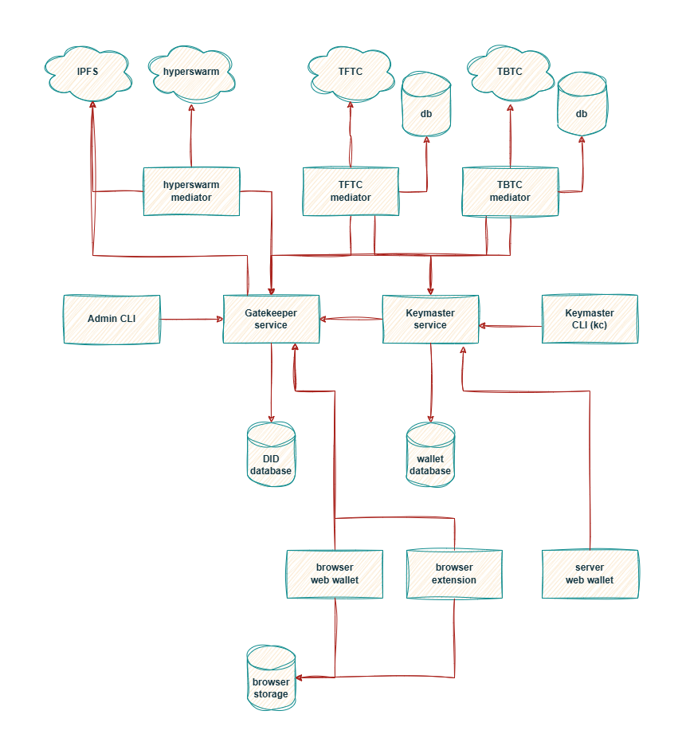

[](https://github.com/KeychainMDIP/kc/actions/workflows/unit-test.yml) [](https://coveralls.io/github/KeychainMDIP/kc?branch=main)

# kc

Keychain (kc) is the reference implementation of the Multi Dimensional Identity Protocol. Visit our website [keychain.org](https://keychain.org) for additional documentation and details.

## Quick start

Recommended system requirements:

- GNU/Linux OS with [docker](https://www.docker.com/) for containerized operation
- node 22.15.0 and npm 10.8.2 or newer for manual and local operation
- minimum of 8Gb RAM if operating a full trustless node

```
$ git clone https://github.com/KeychainMDIP/kc
$ cd kc
$ cp sample.env .env
$ ./start-node
```

### Local Development (for developers)

If you're developing or working on Keychain follow these additional steps after cloning.

```bash
npm install
npm run build
```

## Overview

A Keychain MDIP node includes several interoperating microservices. If you follow the dependency arrows on the diagram below, you will end up at the central core service, the [Gatekeeper service](https://github.com/KeychainMDIP/kc/blob/main/services/gatekeeper/server/README.md) responsible for maintaining the integrity of the local DID database. The mediators are responsible for connecting the Gatekeeper to various networks such as [Hyperswarm](https://github.com/KeychainMDIP/kc/blob/main/services/mediators/hyperswarm/README.md). The TBTC (testnet Bitcoin) and TFTC (testnet Feathercoin) mediators are both instances of the [Satoshi mediator](https://github.com/KeychainMDIP/kc/blob/main/services/mediators/satoshi/README.md) since they are derived from Bitcoin core (they differ only in how they are configured). [Keymaster](https://github.com/KeychainMDIP/kc/blob/main/packages/keymaster/README.md) is the MDIP client responsible for holding the private keys and signing DID operations (create, update, delete) sent to Gatekeeper. The [browser web wallet](https://github.com/KeychainMDIP/kc/blob/main/services/gatekeeper/client/README.md), [browser extension](https://github.com/KeychainMDIP/kc/blob/main/apps/chrome-extension/README.md), and [Keymaster service](https://github.com/KeychainMDIP/kc/blob/main/services/keymaster/server/README.md) all use the [Keymaster library](https://github.com/KeychainMDIP/kc/blob/main/packages/keymaster/README.md). The [server web wallet](https://github.com/KeychainMDIP/kc/blob/main/services/keymaster/client/README.md) is the same as the browser web wallet, except it is configured to talk to the Keymaster service instead of hosting its own wallet. It uses the same [KeymasterClient](https://github.com/KeychainMDIP/kc/blob/main/packages/keymaster/src/keymaster-sdk.ts) as the kc CLI. There are two CLI (command line interface) components: [kc](scripts/keychain-cli.js) for talking to the Keymaster service, and [admin](scripts/admin-cli.js) for talking to the Gatekeeper service. The admin script uses the same [GatekeeperClient](https://github.com/KeychainMDIP/kc/blob/main/packages/gatekeeper/README.md) as the Keymaster service and the mediators.




## Node configuration

Customize your node in the kc/.env file. Environment variables are documented for each service in the READMEs linked in the Overview above.

```
KC_UID=1000                                        # Docker host UID
KC_GID=1002                                        # Docker host GID
KC_NODE_NAME=anon                                  # Hyperswarm node name
KC_NODE_ID=anon                                    # Node Keymaster DID name
KC_GATEKEEPER_REGISTRIES=hyperswarm,TBTC,TFTC      # Supported DID Registries
KC_IPFS_ENABLE=true                                # Enable Gatekeeper IPFS storage and CAS endpoints
...
{adjust registry details for advanced users only}
```

Once your node is operational (start-node), you can setup local dependencies and manage your server using local CLI wallet and other command line tools:

```
$ npm ci                                     # Installs all node package dependencies
$ ./kc -h                                    # Displays kc CLI help
$ ./kc create-id anon TBTC                   # Creates Node Keymaster DID name (set as KC_NODE_ID in .env)
$ ./scripts/tbtc-cli createwallet mdip       # Creates MDIP wallet for Bitcoin Testnet registry
$ ./scripts/tbtc-cli getnewaddress           # Get a new address to fund Bitcoin Testnet wallet
$ ./scripts/tbtc-cli getwalletinfo           # Get a general status of confirmed and incoming funds
```

## Command line interface wallet

Use the CLI `./kc` or the web app at http://localhost:4226 to access the server-side wallet.
Use the web app at http://localhost:4224 to access a client-side (browser) wallet.

```
$ ./kc
Usage: keychain-cli [options] [command]

Keychain CLI tool

Options:
  -V, --version                              output the version number
  -h, --help                                 display help for command

Commands:
  accept-credential [options] <did>        Save verifiable credential for current ID
  add-group-member <group> <member>        Add a member to a group
  add-group-vault-item <id> <file>         Add an item (file) to a group vault
  add-group-vault-member <id> <member>     Add a member to a group vault
  add-name <name> <did>                    Add a name for a DID
  backup-id                                Backup the current ID to its registry
  backup-wallet-did                        Backup wallet to encrypted DID and seed bank
  backup-wallet-file <file>                Backup wallet to file
  bind-credential <schema> <subject>       Create bound credential for a user
  check-wallet                             Validate DIDs in wallet
  clone-asset [options] <id>               Clone an asset
  create-asset [options]                   Create an empty asset
  create-asset-document [options] <file>   Create an asset from a document file
  create-asset-image [options] <file>      Create an asset from an image file
  create-asset-json [options] <file>       Create an asset from a JSON file
  create-challenge [options] [file]        Create a challenge (optionally from a file)
  create-challenge-cc [options] <did>      Create a challenge from a credential DID
  create-group [options] <groupName>       Create a new group
  create-group-vault [options]             Create a group vault
  create-id [options] <name>               Create a new decentralized ID
  create-poll [options] <file>             Create a poll
  create-poll-template                     Create a poll template
  create-response <challenge>              Create a response to a challenge
  create-schema [options] <file>           Create a schema from a file
  create-schema-template <schema>          Create a template from a schema
  create-wallet                            Create a new wallet (or show existing wallet)
  decrypt-did <did>                        Decrypt an encrypted message DID
  decrypt-json <did>                       Decrypt an encrypted JSON DID
  encrypt-file <file> <did>                Encrypt a file for a DID
  encrypt-message <message> <did>          Encrypt a message for a DID
  encrypt-wallet                           Encrypt wallet
  fix-wallet                               Remove invalid DIDs from the wallet
  get-asset <id>                           Get asset by name or DID
  get-credential <did>                     Get credential by DID
  get-group <did>                          Get group by DID
  get-group-vault-item <id> <item> <file>  Save an item from a group vault to a file
  get-name <name>                          Get DID assigned to name
  get-schema <did>                         Get schema by DID
  help [command]                           display help for command
  import-wallet <recovery-phrase>          Create new wallet from a recovery phrase
  issue-credential [options] <file>        Sign and encrypt a bound credential file
  list-assets                              List assets owned by current ID
  list-credentials                         List credentials by current ID
  list-group-vault-items <id>              List items in the group vault
  list-group-vault-members <id>            List members of a group vault
  list-groups                              List groups owned by current ID
  list-ids                                 List IDs and show current ID
  list-issued                              List issued credentials
  list-names                               List DID names (aliases)
  list-schemas                             List schemas owned by current ID
  perf-test [N]                            Performance test to create N credentials
  publish-credential <did>                 Publish the existence of a credential to the current user manifest
  publish-poll <poll>                      Publish results to poll, hiding ballots
  recover-id <did>                         Recovers the ID from the DID
  recover-wallet-did [did]                 Recover wallet from seed bank or encrypted DID
  remove-group-member <group> <member>     Remove a member from a group
  remove-group-vault-item <id> <item>      Remove an item from a group vault
  remove-group-vault-member <id> <member>  Remove a member from a group vault
  remove-id <name>                         Deletes named ID
  remove-name <name>                       Removes a name for a DID
  rename-id <oldName> <newName>            Renames the ID
  resolve-did <did> [confirm]              Return document associated with DID
  resolve-did-version <did> <version>      Return specified version of document associated with DID
  resolve-id                               Resolves the current ID
  restore-wallet-file <file>               Restore wallet from backup file
  reveal-credential <did>                  Reveal a credential to the current user manifest
  reveal-poll <poll>                       Publish results to poll, revealing ballots
  revoke-credential <did>                  Revokes a verifiable credential
  revoke-did <did>                         Permanently revoke a DID
  rotate-keys                              Generates new set of keys for current ID
  set-property <id> <key> [value]          Assign a key-value pair to an asset
  show-mnemonic                            Show recovery phrase for wallet
  show-wallet                              Show wallet
  sign-file <file>                         Sign a JSON file
  test-group <group> [member]              Determine if a member is in a group
  transfer-asset <id> <controller>         Transfer asset to a new controller
  unpublish-credential <did>               Remove a credential from the current user manifest
  unpublish-poll <poll>                    Remove results from poll
  update-asset-document <id> <file>        Update an asset from a document file
  update-asset-image <id> <file>           Update an asset from an image file
  update-asset-json <id> <file>            Update an asset from a JSON file
  update-poll <ballot>                     Add a ballot to the poll
  use-id <name>                            Set the current ID
  verify-file <file>                       Verify the signature in a JSON file
  verify-response <response>               Decrypt and validate a response to a challenge
  view-poll <poll>                         View poll details
  vote-poll <poll> <vote> [spoil]          Vote in a poll
```

## admin-cli

Use the admin CLI to manage and view status of your server's DID registry operations.

```
$ ./admin
Usage: admin-cli [options] [command]

Admin CLI tool

Options:
  -V, --version                                                output the version number
  -h, --help                                                   display help for command

Commands:
  cas-add-file <file>                                          Add a file to the CAS
  cas-add-json <file>                                          Add JSON file to the CAS
  cas-add-text <text>                                          Add text to the CAS
  cas-get-file <cid> <file>                                    Get a file from the CAS
  cas-get-json <cid>                                           Get JSON from the CAS
  cas-get-text <cid>                                           Get text from the CAS
  export-batch                                                 Export all events in a batch
  export-did <did>                                             Export DID to file
  export-dids                                                  Export all DIDs
  get-block <registry> [blockHeightOrHash]                     Get block info for registry
  get-dids [updatedAfter] [updatedBefore] [confirm] [resolve]  Fetch all DIDs
  get-status                                                   Report gatekeeper status
  hash-dids <file>                                             Compute hash of batch
  help [command]                                               display help for command
  import-batch-file <file> [registry]                          Import batch of events
  import-did <file>                                            Import DID from file
  import-dids <file>                                           Import DIDs from file
  list-registries                                              List supported registries
  perf-test [full]                                             DID resolution performance test
  process-events                                               Process events queue
  reset-db                                                     Reset the database to empty
  resolve-did <did> [confirm]                                  Return document associated with DID
  show-queue <registry>                                        Show queue for a registry
  verify-db                                                    Verify all the DIDs in the db
  verify-did <did>                                             Return verified document associated with DID
```

## Upgrade

To upgrade to the latest version:

```
$ ./stop-node
$ git pull
$ ./start-node
```
