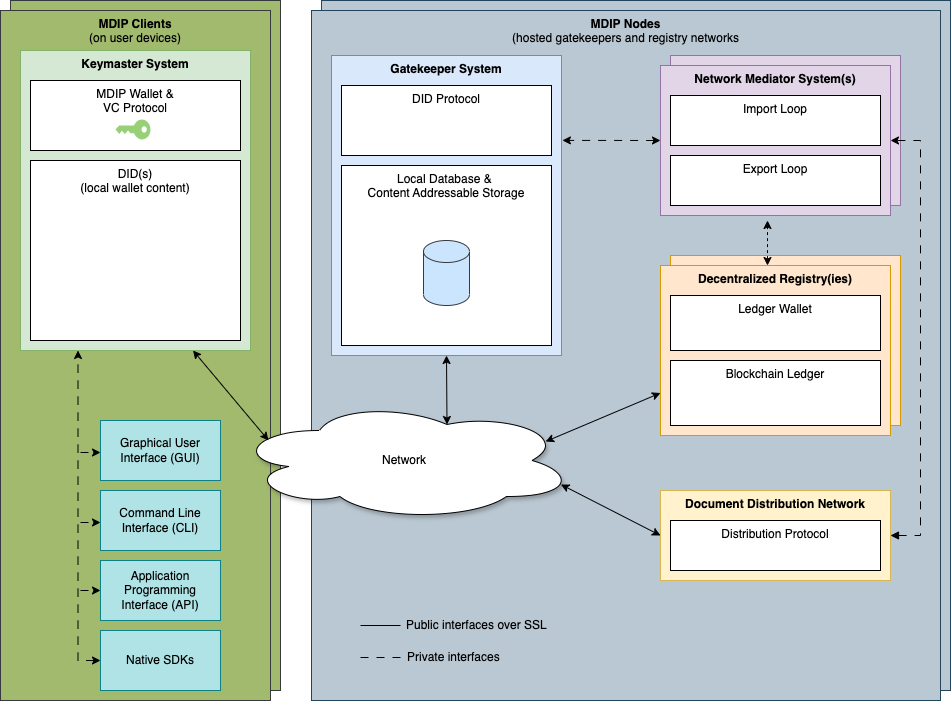

This guide covers the current `main` branch. Keychain MDIP implements the Multi-Dimensional Identity Protocol described in the [MDIP DID Scheme](https://keychain.org/docs/protocol/scheme).

The repository's [`docker-compose.yml`](https://github.com/KeychainMDIP/kc/blob/main/docker-compose.yml) and [`sample.env`](https://github.com/KeychainMDIP/kc/blob/main/sample.env) are the authoritative deployment configuration. This guide explains how to use them without duplicating their full contents.

## Node architecture

The diagram below shows the high-level protocol roles and data flow. The service table that follows maps those roles to the current Compose services.



A full node combines the following services:

| Service | Purpose | Default host port |
| --- | --- | --- |
| `gatekeeper` | Validates DID operations and maintains the DID database | `4224` |
| `keymaster` | Holds the server wallet and signs or decrypts operations | `4226` |
| `hypr-mediator` | Distributes operations over Hyperswarm | none |
| `search-server` | Builds a searchable read model from Gatekeeper's index export | `4002` |
| `explorer` | Displays DIDs, events, credentials, receipts, and network metrics | `4000` |
| `react-wallet` | Browser and mobile wallet web application | `4228` |
| `ipfs` | Optional content-addressable storage | `4001`, local API `5001` |
| `mongodb`, `redis`, `postgres` | Available database backends | loopback only |
| Satoshi nodes and mediators | Commit batch DIDs or complete operations to configured blockchains | network-specific |
| `cli` | Runs the `kc`, `admin`, and IPFS command-line clients | none |

The Compose file includes Bitcoin, Bitcoin Testnet4, Bitcoin Signet, and Feathercoin Testnet nodes and mediators. Bitcoin and Signet also have inscription mediator configurations. Their Gatekeeper registry names are `BTC-Inscription`, `TBTC`, `Signet`, `Signet-Inscription`, and `TFTC`. Enable only the registries the node intends to operate.

Gatekeeper is the core service. Keymaster and the mediators submit operations to it. Search Server consumes Gatekeeper's ordered index export. Explorer reads Search Server. IPFS is optional and controlled by a Compose profile.

## Requirements

- GNU/Linux host
- Docker Engine with the Docker Compose plugin
- Enough memory and storage for the selected services. Blockchain nodes require substantially more disk, memory, and initial-sync time
- A stable network connection and enough storage for every enabled registry
- Node.js 22.15.0 and npm 10.8.2 or newer only when building or running services outside Docker

Do not expose database, Keymaster, or blockchain RPC ports to the public Internet.

## Install

```bash
git clone https://github.com/KeychainMDIP/kc.git
cd kc
cp sample.env .env
```

Set the container UID and GID to the account that owns the repository and `data` directory:

```bash
id -u
id -g
```

Copy those values to `KC_UID` and `KC_GID` in `.env`. At minimum, also review:

| Variable | Purpose |
| --- | --- |
| `KC_NODE_NAME` | Human-readable Hyperswarm node name |
| `KC_NODE_ID` | Keymaster ID name used by the node and mediators |
| `KC_ENCRYPTED_PASSPHRASE` | Required passphrase used to encrypt the server wallet. Set a strong value and retain it securely |
| `KC_GATEKEEPER_REGISTRIES` | Comma-separated registries accepted by Gatekeeper |
| `KC_DEFAULT_REGISTRY` | Registry used by Keymaster when no command option is supplied |
| `KC_GATEKEEPER_DID_PREFIX` | Fallback prefix for create operations that omit one |
| `KC_KEYMASTER_DID_PREFIX` | Prefix embedded in new signed create operations |
| `KC_IPFS_ENABLE` | Enables or disables the IPFS profile and CAS storage |
| `KC_GATEKEEPER_DB` | Gatekeeper database adapter |
| `KC_KEYMASTER_DB` | Keymaster wallet database adapter |
| `KC_HYPR_DB` | Hyperswarm sync-store adapter |
| `KC_SEARCH_SERVER_DB` | Search read-model adapter |

### Satoshi mediator prefixes

Docker Compose exposes separate settings for each bundled blockchain mediator. For mapped settings, replace the generic `KC_SAT_*` prefix documented by the Satoshi mediator with the appropriate network prefix. For example, Compose passes `KC_TBTC_FEE_MAX` to the Testnet4 mediator as `KC_SAT_FEE_MAX`.

| Prefix | Network |
| --- | --- |
| `KC_BTC_*` | Bitcoin inscription |
| `KC_TBTC_*` | Bitcoin Testnet4 |
| `KC_TFTC_*` | Feathercoin testnet |
| `KC_SIGNET_*` | Bitcoin Signet |
| `KC_SIGNET_INS_*` | Signet inscription |

The root `sample.env` provides the values for each network. The [Satoshi mediator](https://github.com/KeychainMDIP/kc/blob/main/services/mediators/satoshi/README.md) and [Satoshi inscription mediator](https://github.com/KeychainMDIP/kc/blob/main/services/mediators/satoshi-inscription/README.md) READMEs define the corresponding generic `KC_SAT_*` settings. Network identity fields such as chain, network, host, and port are set directly in `docker-compose.yml` for the bundled services.

Compose constructs internal PostgreSQL URLs from `KC_POSTGRES_DB`, `KC_POSTGRES_USER`, and `KC_POSTGRES_PASSWORD`. The PostgreSQL URL variables documented in the component READMEs apply when running services outside Compose.

The service READMEs document the remaining settings:

- [Gatekeeper](https://github.com/KeychainMDIP/kc/blob/main/services/gatekeeper/server/README.md)
- [Keymaster](https://github.com/KeychainMDIP/kc/blob/main/services/keymaster/server/README.md)
- [Hyperswarm mediator](https://github.com/KeychainMDIP/kc/blob/main/services/mediators/hyperswarm/README.md)
- [Satoshi mediator](https://github.com/KeychainMDIP/kc/blob/main/services/mediators/satoshi/README.md)
- [Satoshi inscription mediator](https://github.com/KeychainMDIP/kc/blob/main/services/mediators/satoshi-inscription/README.md)
- [Search Server](https://github.com/KeychainMDIP/kc/blob/main/services/search-server/README.md)

When run directly, Node services load environment variables from the process and from `.env` files discovered between the working directory and workspace root. `KC_ENV_FILE` selects an additional explicit file, and existing process variables take precedence. Compose uses the root `.env` for interpolation and passes the variables declared in `docker-compose.yml` into each container.

## Start and stop

Run `start-node` from the repository root. It is a Docker Compose wrapper that stops the existing stack, rebuilds the selected services, and starts them in the foreground. With no service names, it starts every Compose service, including every blockchain node and mediator:

```bash
./start-node
```

For isolated DID and credential testing through Keymaster's API or web interface, select Gatekeeper and Keymaster:

```bash
./start-node gatekeeper keymaster
```

Add the Hyperswarm mediator and CLI for a networked core node that can be managed with the repository wrappers. Without the mediator, Gatekeeper does not publish or receive operations over Hyperswarm:

```bash
./start-node gatekeeper keymaster hypr-mediator cli
```

Compose automatically starts MongoDB, Redis, PostgreSQL, and Search Server because they are declared dependencies of Gatekeeper and Keymaster. Only the database adapters selected in `.env` are used. Omit `cli` if you only use the APIs or web interfaces. Explorer, React Wallet, and all Bitcoin-family nodes and mediators are optional.

When `KC_IPFS_ENABLE` is not `false`, `start-node` also enables the `ipfs` profile.

To start the same selected services in the background with IPFS enabled, both activate the profile and name the `ipfs` service:

```bash
docker compose --profile ipfs up --build -d ipfs gatekeeper keymaster hypr-mediator cli
```

When IPFS is disabled, omit `--profile ipfs`:

```bash
docker compose up --build -d gatekeeper keymaster hypr-mediator cli
```

When an explicit service list is supplied, activating a profile does not add its services automatically. Name `ipfs` as shown above, or omit all service names to start the full stack.

Stop the node, including profile services:

```bash
./stop-node
```

## Node identity

During startup, Keymaster automatically creates the identity named by `KC_NODE_ID` if it is missing, then waits until Gatekeeper can resolve it. New node identities use `KC_DEFAULT_REGISTRY`. Set both variables before the first startup.

Once Keymaster is ready, confirm the identity:

```bash
./kc list-ids
./kc resolve-did mynodeID
```

Changing `KC_NODE_ID` later causes Keymaster to resolve an existing identity with that name or create a new one. Restart services that use the node identity after changing it.

Blockchain mediators also require a funded wallet in the corresponding blockchain node. For example:

```bash
./scripts/tbtc-cli createwallet mdip
./scripts/tbtc-cli getnewaddress
./scripts/tbtc-cli getwalletinfo
```

Fund the returned address with the appropriate testnet or mainnet currency before enabling exports. Never reuse testnet credentials, RPC passwords, or wallet funds for mainnet.

## Storage

The default adapters in `sample.env` are:

| Component | Default adapter |
| --- | --- |
| Gatekeeper | Redis |
| Keymaster wallet | JSON |
| Hyperswarm sync store | SQLite |
| Search Server | SQLite |
| Satoshi mediators | JSON |

Gatekeeper and Keymaster also support JSON, SQLite, MongoDB, Redis, and PostgreSQL where documented. Search Server supports SQLite, PostgreSQL, and in-memory storage. Memory is intended for development and tests. Hyperswarm supports SQLite and PostgreSQL.

The Compose MongoDB service runs as a single-node replica set because Gatekeeper's MongoDB adapter uses transactions. A standalone `mongod` is not supported.

Persistent service data is bind-mounted under `data/`. The `share/` directory is also mounted into IPFS and the CLI for exchanging files. Do not copy live database files as a backup. Stop the node first or use the database's native consistent-backup tooling. Protect Keymaster wallet data and mnemonic backups as secrets.

Search Server is a rebuildable read model. Releases that change its schema may require its database to be reset and rebuilt from Gatekeeper.

## IPFS-optional operation

Set `KC_IPFS_ENABLE=false` to run without IPFS. In that mode:

- DID generation, event storage, and resolution continue without IPFS.
- Gatekeeper CAS endpoints return `503 IPFS disabled`.
- Hyperswarm continues to sync and relay operations.
- Hyperswarm does not publish IPFS peer information and does not require `KC_NODE_ID` for IPFS peering.

## Verify the deployment

```bash
docker compose ps
curl http://localhost:4224/api/v1/ready
curl http://localhost:4226/api/v1/ready
curl http://localhost:4002/api/v1/ready
./admin get-status
./admin list-registries
```

The `./admin` commands require the `cli` service. Omit them when the deployment was started without `cli`.

Inspect the main service logs when readiness checks fail:

```bash
docker compose logs -f gatekeeper keymaster hypr-mediator search-server
```

When their corresponding services and embedded clients are enabled, the local user interfaces are available at:

- client-side wallet: `http://localhost:4224`
- server-side Keymaster wallet: `http://localhost:4226`
- Explorer: `http://localhost:4000`
- React Wallet: `http://localhost:4228`

## Public hosting

Keymaster controls the server wallet and must remain private. Database and blockchain RPC ports must also remain private. For a read-only public resolver, expose only the required Gatekeeper read endpoints, preferably through a firewall and TLS reverse proxy.

The following read-only nginx example deliberately denies every other API route. Add your certificate configuration separately.

```nginx
server {
    listen 443 ssl;
    server_name mdip.example.com;

    location = /api/v1/ready {
        proxy_pass http://127.0.0.1:4224;
    }

    location = /api/v1/version {
        proxy_pass http://127.0.0.1:4224;
    }

    location = /api/v1/registries {
        proxy_pass http://127.0.0.1:4224;
    }

    location ^~ /api/v1/did/ {
        limit_except GET { deny all; }
        proxy_pass http://127.0.0.1:4224;
    }

    location ^~ /api/ {
        return 404;
    }

    location / {
        proxy_pass http://127.0.0.1:4224;
    }
}
```

Do not expose Gatekeeper's write, queue, database-reset, import, block, or CAS mutation endpoints without authentication and authorization appropriate to the deployment.

If the public service is behind a trusted reverse proxy, set the relevant `*_TRUST_PROXY` option and configure API rate limiting. Do not enable trust-proxy handling for untrusted direct traffic.

## Upgrade

Back up `.env`, Keymaster wallet data, and every non-rebuildable database before upgrading. Then:

```bash
./stop-node
git pull --ff-only
./start-node gatekeeper keymaster hypr-mediator cli
```

Use the same explicit service list as your existing deployment. A bare `./start-node` starts the full Compose stack. Review release notes, `sample.env`, and database migration or reset notes before starting a new release. Keep local secrets in `.env`. Do not commit them.
