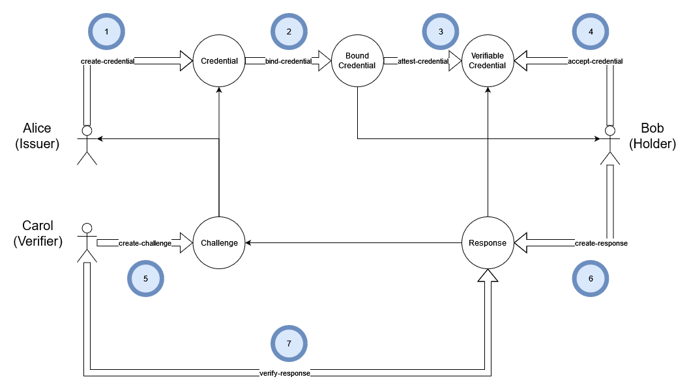

The credential operations below use the structures defined in the [W3C Verifiable Credentials Data Model 2.0](https://www.w3.org/TR/vc-data-model-2.0/).

## What is a Credential?

From W3C:
> Credentials are a part of our daily lives. Driver's licenses are used to assert that we are capable of operating a motor vehicle, university degrees can be used to assert our level of education, and government-issued passports enable us to travel between countries. These credentials provide benefits to us when used in the physical world, but their use on the Web continues to be elusive.
>
> \- [Source](https://www.w3.org/TR/vc-data-model/#abstract)

## What is a Verifiable Credential?

From W3C:
> A verifiable credential (VC) can represent all of the same information that a physical credential represents. The addition of technologies, such as digital signatures, makes verifiable credentials more tamper-evident and more trustworthy than their physical counterparts.
>
> \- [Source](https://www.w3.org/TR/vc-data-model/#what-is-a-verifiable-credential)

## MDIP Verifiable Credential Basic Workflow



The basic workflow involves three actors: Alice (the Issuer), Bob (the Holder), and Carol (the Verifier). In this scenario, Bob wishes to gain access to some resource controlled by Carol. Carol will grant Bob access only if Bob can prove that he owns a particular credential issued by Alice.

### Steps to Create a VC

1. The Issuer (Alice) creates a credential schema. The schema describes the fields used by credentials of that type.
1. The Issuer binds a credential template to a Holder.
1. The Issuer issues a credential by signing it and encrypting it for the Holder, creating a Verifiable Credential (VC).
1. The Holder (Bob) accepts the VC (adding it to their wallet for future use).
1. The Verifier (Carol) creates a Challenge. A Challenge is a list of Credentials and trusted Issuers.
1. The Holder creates an encrypted Response containing presentations of matching VCs.
1. The Verifier validates the Response by checking that it fulfills every requested credential, that each VC has an accepted issuer and valid signature, and that its source credential has not been revoked.

## Preparing or Selecting a Credential Schema File

JSON Schemas are ubiquitous. The schema defines the content of a future credential. Standardized schemas (ex: schema.org) for common credentials (ex: address, membership, etc) should be used to facilitate data interoperability.

```console
$ cat data/schema/social-media.json
{
    "$schema": "http://json-schema.org/draft-07/schema#",
    "type": "object",
    "properties": {
        "service": {
            "type": "string"
        },
        "account": {
            "type": "string",
            "format": "uri"
        }
    },
    "required": [
        "service",
        "account"
    ]
}
```

## Creating a Credential DID

MDIP-compatible credentials are created using a JSON schema file as a template. The schema file will be registered with a Gatekeeper to create the Credential and receive its associated DID.

```sh
$ kc create-schema data/schema/social-media.json --name social-media
did:test:z3v8AuaeAPf9JMuyYZ1D79D626uUzDQmRPwq4d8oB1Th6ztzAS7
```

```console
$ kc list-names
{
    "social-media": "did:test:z3v8AuaeAPf9JMuyYZ1D79D626uUzDQmRPwq4d8oB1Th6ztzAS7"
}
```

```console
$ kc resolve-did social-media
{
    "didDocument": {
        "@context": [
            "https://www.w3.org/ns/did/v1"
        ],
        "id": "did:test:z3v8AuaeAPf9JMuyYZ1D79D626uUzDQmRPwq4d8oB1Th6ztzAS7",
        "controller": "did:test:z3v8AuabRm9DaiakqbwFPgsLd6vSYBQtdj7poQFGYBgsZCfqTvY"
    },
    "didDocumentMetadata": {
        "created": "2024-03-22T15:00:31.047Z",
        "canonicalId": "did:test:z3v8AuaeAPf9JMuyYZ1D79D626uUzDQmRPwq4d8oB1Th6ztzAS7"
    },
    "didDocumentData": {
        "schema": {
            "$schema": "http://json-schema.org/draft-07/schema#",
            "properties": {
                "account": {
                    "format": "uri",
                    "type": "string"
                },
                "service": {
                    "type": "string"
                }
            },
            "required": [
                "service",
                "account"
            ],
            "type": "object"
        }
    },
    "mdip": {
        "registry": "hyperswarm",
        "prefix": "did:test",
        "type": "asset",
        "version": 1
    }
}
```

The command above created a DID document containing the schema file. For convenience, the user's wallet now contains the alias `social-media` for the schema DID.

## Binding the Credential

The Credential DID must now be bound to the Agent DID who is to become the Subject of the new credential. The binding process will generate a credential in JSON form that will be pre-populated with the DIDs of subject, issuer and credential type.

In the command below, both `social-media` and `Bob`  are resolved to their respective DIDs using the named alias and identity names from the user's private wallet:

```console
$ kc bind-credential social-media Bob
{
    "@context": [
        "https://www.w3.org/ns/credentials/v2",
        "https://www.w3.org/ns/credentials/examples/v2"
    ],
    "type": [
        "VerifiableCredential",
        "did:test:z3v8AuaeAPf9JMuyYZ1D79D626uUzDQmRPwq4d8oB1Th6ztzAS7"
    ],
    "issuer": "did:test:z3v8AuabRm9DaiakqbwFPgsLd6vSYBQtdj7poQFGYBgsZCfqTvY",
    "validFrom": "2024-03-22T15:04:33.684Z",
    "validUntil": null,
    "credentialSubject": {
        "id": "did:test:z3v8AuairhLoGZqf6UDKw7zXyBknTvanvSzFHnLpwy8nwa7WLzk"
    },
    "credential": {
        "account": "http://yNtjneCOyzLGUNtiAK.wnarGe6zodO-cGG47CGWl66-kvLbKVHCrFQPFy-ihIYfNlEuc",
        "service": "in sit aliquip"
    }
}
```

This bound credential does not yet contain user-specific information other than the DID. The binding process pre-filled the required fields (`account` and `service`) with dummy data to replace in the next step.

## Editing the Credential

The bound credential must be populated with holder-specific information. This step will typically be automated in most deployments. In the case of our social media schema, we must populate a service field with the name of an online social media provider, and we must populate the account field with a URL to the holder's specific social media account.

```sh
$ kc bind-credential social-media Bob > bob-twitter.json
(output sent to the bob-twitter.json file)
```

Edit the `bob-twitter.json` file to populate the `credential.account` and `credential.service` fields with information that is pertinent with the subject of the credential:

```sh
$ cat bob-twitter.json
{
    "@context": [
        "https://www.w3.org/ns/credentials/v2",
        "https://www.w3.org/ns/credentials/examples/v2"
    ],
    "type": [
        "VerifiableCredential",
        "did:test:z3v8AuaeAPf9JMuyYZ1D79D626uUzDQmRPwq4d8oB1Th6ztzAS7"
    ],
    "issuer": "did:test:z3v8AuabRm9DaiakqbwFPgsLd6vSYBQtdj7poQFGYBgsZCfqTvY",
    "validFrom": "2024-03-22T15:06:24.773Z",
    "validUntil": null,
    "credentialSubject": {
        "id": "did:test:z3v8AuairhLoGZqf6UDKw7zXyBknTvanvSzFHnLpwy8nwa7WLzk"
    },
    "credential": {
        "account": "https://twitter.com/bob",
        "service": "twitter.com"
    }
}
```

## Attesting a credential

The credential, bound and populated with the subject's information, must now be signed by the issuer and encrypted to the subject's keys:

```sh
$ kc issue-credential bob-twitter.json
did:test:z3v8AuaZAWJuERtD5CwDu2mNpLHjJ6imdNGTwdZpfKY6FK5ASk2
```

The issuer (Alice) should now send the VC's DID to the subject (Bob).

## Inspecting a credential

Only the issuer and holder can decrypt the VC by default. When Bob receives the credential from Alice, he can inspect its contents before accepting it:

```console
$ kc decrypt-json did:test:z3v8AuaZAWJuERtD5CwDu2mNpLHjJ6imdNGTwdZpfKY6FK5ASk2
{
    "@context": [
        "https://www.w3.org/ns/credentials/v2",
        "https://www.w3.org/ns/credentials/examples/v2"
    ],
    "type": [
        "VerifiableCredential",
        "did:test:z3v8AuaeAPf9JMuyYZ1D79D626uUzDQmRPwq4d8oB1Th6ztzAS7"
    ],
    "issuer": "did:test:z3v8AuabRm9DaiakqbwFPgsLd6vSYBQtdj7poQFGYBgsZCfqTvY",
    "validFrom": "2024-03-22T15:06:24.773Z",
    "validUntil": null,
    "credentialSubject": {
        "id": "did:test:z3v8AuairhLoGZqf6UDKw7zXyBknTvanvSzFHnLpwy8nwa7WLzk"
    },
    "credential": {
        "account": "https://twitter.com/bob",
        "service": "twitter.com"
    },
    "signature": {
        "signer": "did:test:z3v8AuabRm9DaiakqbwFPgsLd6vSYBQtdj7poQFGYBgsZCfqTvY",
        "signed": "2024-03-22T15:09:02.994Z",
        "hash": "62f7cb1a31d338d29287f9ce91b4da103391dca88b853ea1b05920c6049ae8ff",
        "value": "37941a42492a431ceaff91c86de55eb0cd3ed98107a3ce19a76d88511b7fe2bc6fcf298c69e431b048ab0786e9624b647e4d03a4c26031c4c6e2b6882223defe"
    }
}
```

## Accepting a credential

Accepting a credential adds the DID to the user's local wallet:

```sh
$ kc accept-credential did:test:z3v8AuaZAWJuERtD5CwDu2mNpLHjJ6imdNGTwdZpfKY6FK5ASk2
OK
```

```console
$ kc show-wallet
{
    "version": 1,
    "seed": {
        "mnemonicEnc": {
            "salt": "...",
            "iv": "...",
            "data": "..."
        }
    },
    "counter": 3,
    "ids": {
        "Alice": {
            "did": "did:test:z3v8AuabRm9DaiakqbwFPgsLd6vSYBQtdj7poQFGYBgsZCfqTvY",
            "account": 0,
            "index": 1,
            "owned": [
                "did:test:z3v8AuaeAPf9JMuyYZ1D79D626uUzDQmRPwq4d8oB1Th6ztzAS7",
                "did:test:z3v8AuaZAWJuERtD5CwDu2mNpLHjJ6imdNGTwdZpfKY6FK5ASk2"
            ]
        },
        "Bob": {
            "did": "did:test:z3v8AuairhLoGZqf6UDKw7zXyBknTvanvSzFHnLpwy8nwa7WLzk",
            "account": 2,
            "index": 0,
            "held": [
                "did:test:z3v8AuaZAWJuERtD5CwDu2mNpLHjJ6imdNGTwdZpfKY6FK5ASk2"
            ]
        }
    },
    "current": "Bob",
    "names": {
        "social-media": "did:test:z3v8AuaeAPf9JMuyYZ1D79D626uUzDQmRPwq4d8oB1Th6ztzAS7"
    }
}
```

## Revoking a credential

The issuer of a credential can revoke their credential at any time. This will blank out the VC's credential content data and set the `didDocumentMetadata.deactivated` property to true.

```sh
$ kc revoke-credential did:test:z3v8AuaZAWJuERtD5CwDu2mNpLHjJ6imdNGTwdZpfKY6FK5ASk2
OK
```

```console
$ kc resolve-did did:test:z3v8AuaZAWJuERtD5CwDu2mNpLHjJ6imdNGTwdZpfKY6FK5ASk2
{
    "didDocument": {
        "id": "did:test:z3v8AuaZAWJuERtD5CwDu2mNpLHjJ6imdNGTwdZpfKY6FK5ASk2"
    },
    "didDocumentMetadata": {
        "created": "2024-03-22T15:09:03.056Z",
        "deactivated": true,
        "deleted": "2024-03-22T15:17:53.368Z",
        "canonicalId": "did:test:z3v8AuaZAWJuERtD5CwDu2mNpLHjJ6imdNGTwdZpfKY6FK5ASk2"
    },
    "didDocumentData": {},
    "mdip": {
        "registry": "hyperswarm",
        "prefix": "did:test",
        "type": "asset",
        "version": 1
    }
}
```
