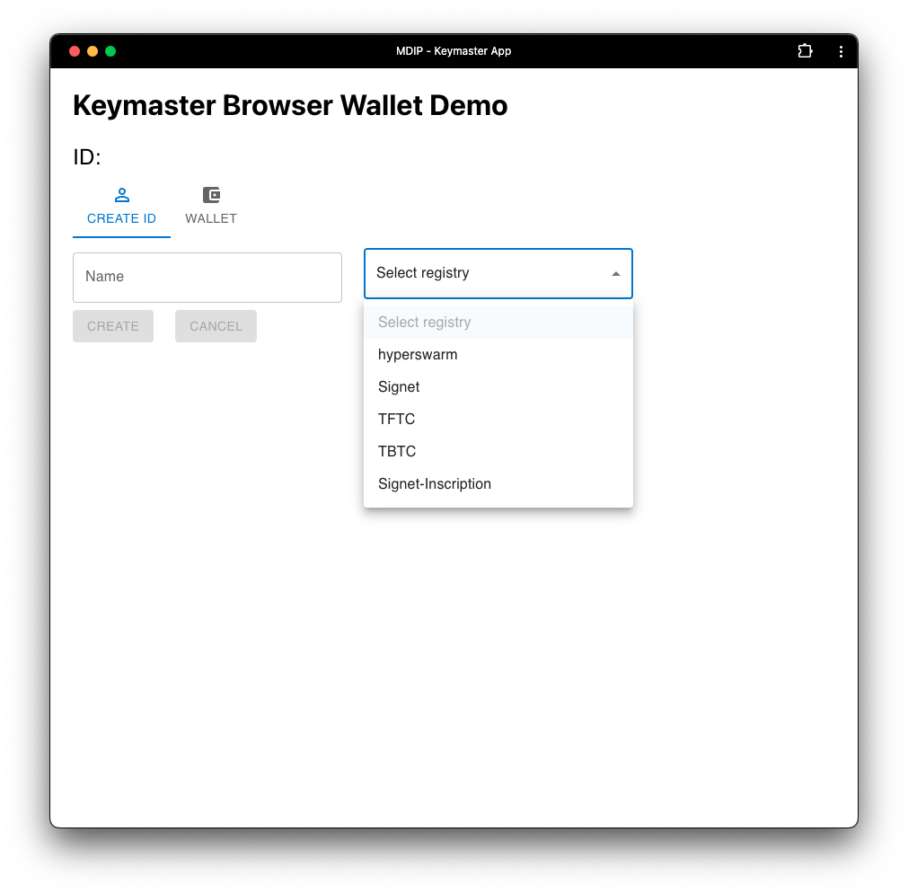
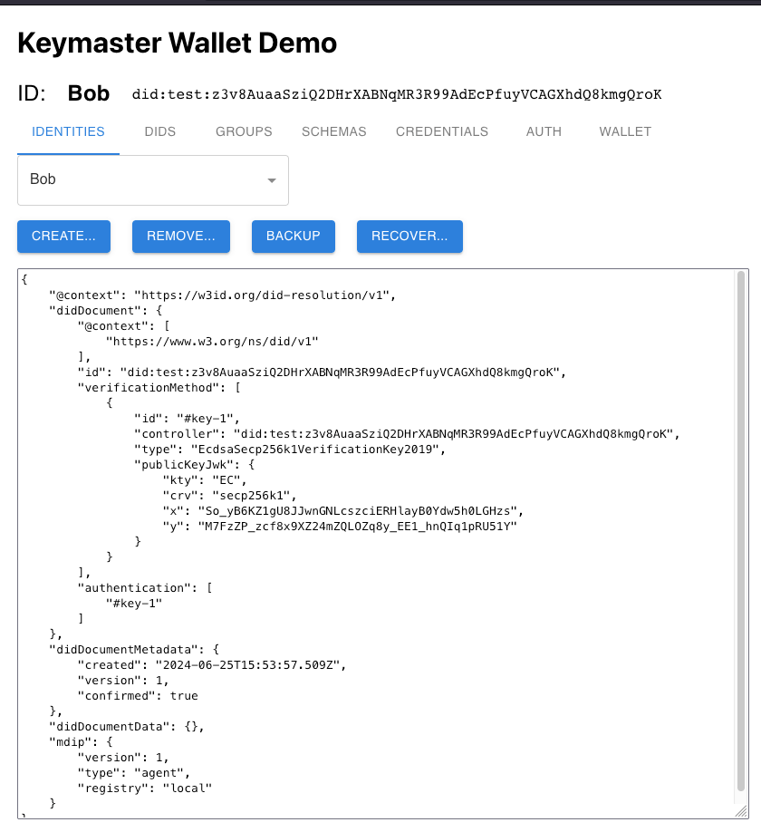

When operating a local MDIP node, visit http://localhost:4224 and set a wallet passphrase. The browser then creates an encrypted MDIP wallet in local browser storage. Private wallet data and keys remain client-side. The screen below shows a blank wallet:

An MDIP wallet may contain multiple Agent DIDs, or identities. Each DID can be registered on a registry of the user's choice. 

The MDIP Wallet above now contains an Agent DID nicknamed "Bob". Once a DID is created, numerous new Keymaster wallet functions become available:

1. [IDENTITIES](./03-identities.md): Create and manage new Agent DIDs.
1. [DIDS](./04-dids.md): Manage nicknames to known DIDs. Can be used to name any type of DIDs (agent, asset, groups, etc).
1. [ASSETS](./05-assets.md): Create and manage asset DIDs.
1. [CREDENTIALS](./06-credentials.md): Users can issue and manage their verifiable credentials.
1. [DMAIL](./07-dmail.md): Create and manage P2P messages with other Agent DIDs.
1. [AUTH](./09-auth.md): Create and/or respond to MDIP authentication challenges.
1. [WALLET](./10-wallet.md): Wallet-level functions, seed phrase, backup and restore methods.
