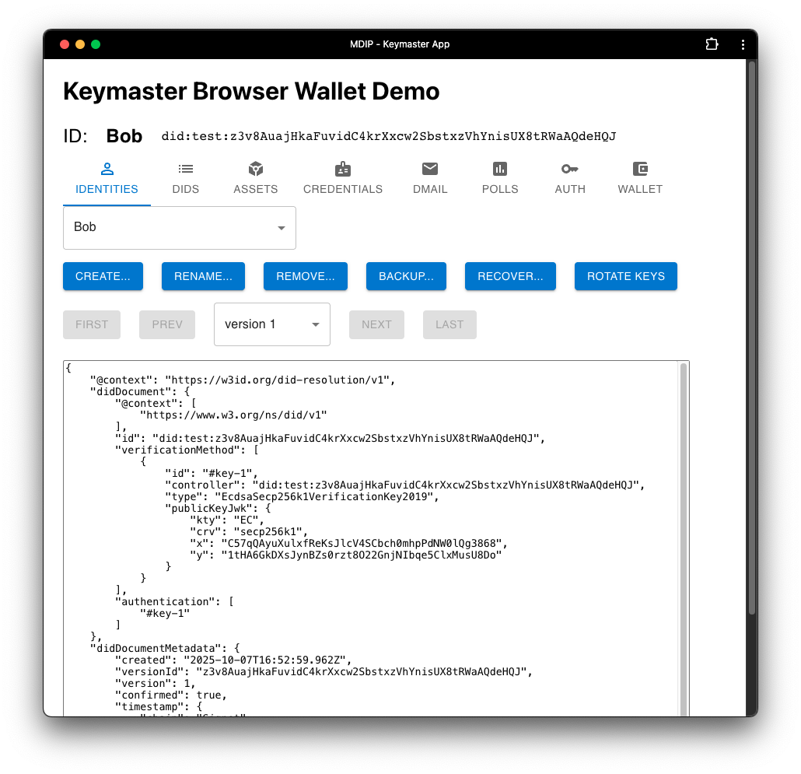

When operating a local MDIP node, you can visit http://localhost:4224 to automatically generate a new MDIP Wallet. The keys and all information contained in an MDIP wallet are only available on the client-side. The screen below shows a blank MDIP wallet:

An MDIP wallet may contain multiple Agent DIDs, or identities. Each DID can be registered on a registry of the user's choice. 

The MDIP Wallet above now contains an Agent DID nicknamed "Bob". Once a DID is created, numerous new Keymaster wallet functions become available:

1. [IDENTITIES](./identities): Create and manage new Agent DIDs.
1. [DIDS](./dids): Manage nicknames to known DIDs. Can be used to name any type of DIDs (agent, asset, groups, etc).
1. [ASSETS](./assets): Create and manage asset DIDs.
1. [CREDENTIALS](./credentials): Users can issue and manage their verifiable credentials.
1. [DMAIL](./dmail): Create and manage P2P messages with other Agent DIDs.
1. [AUTH](./auth): Create and/or respond to MDIP authentication challenges.
1. [WALLET](./wallet): Wallet-level functions, seed phrase, backup and restore methods. 