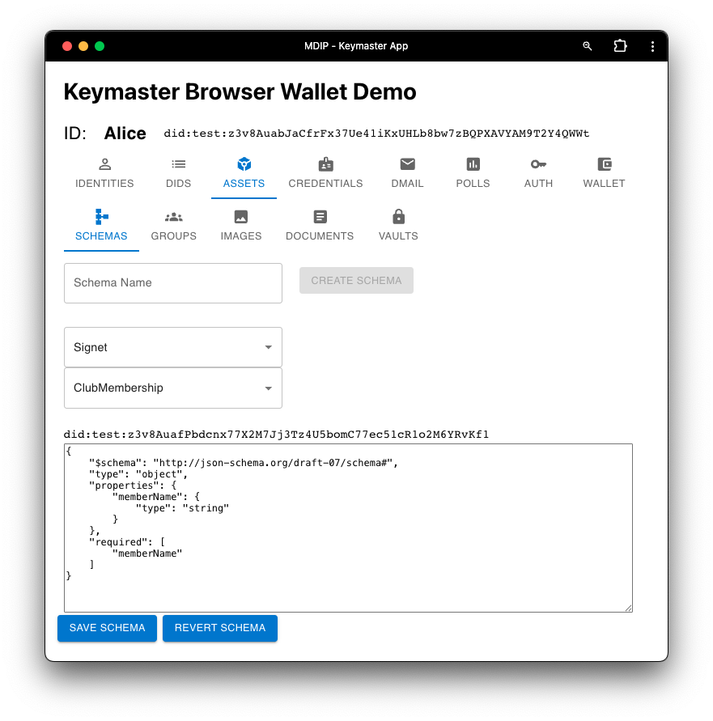
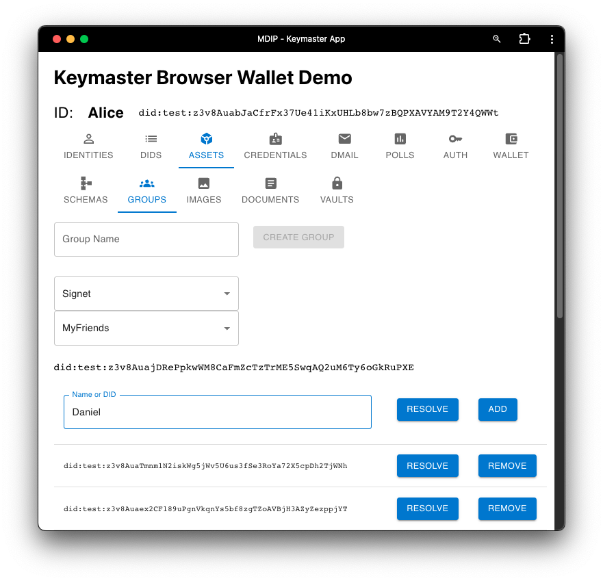

The Assets screen allows a user to create and manage multiple types of digital assets.

## SCHEMAS Screen

In the Schemas screen, users can create their own Verifiable Credential schemas or access schemas created and registered on MDIP by other users. Here, Alice creates a "ClubMembership" schema containing a "memberName".

## GROUPS Screen

Here, users can group DIDs together, under a new Group DID. Groups can contain groups. Groups are public documents, which means other network nodes will see the DIDs contained in a group DID. 

## IMAGES Screen

This screen allows users to assign an Asset DID to an image file. The file is uploaded to the node's content addressable storage subsystem (IPFS).

## DOCUMENTS Screen

This screen allows users to assign an Asset DID to a document. The file is "notarized" on the registry selected by the user.

## VAULTS Screen

Create encrypted vaults that can contain any number of digital items and any number of recipient members. Read access to the Vault may be shared with Member DIDs. 

