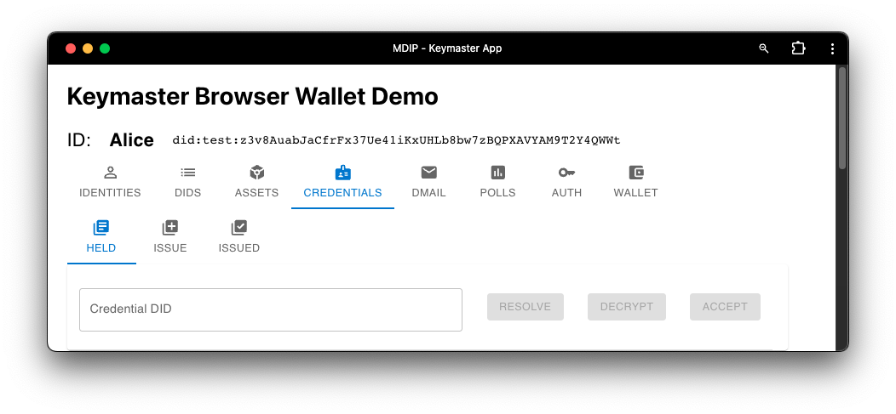
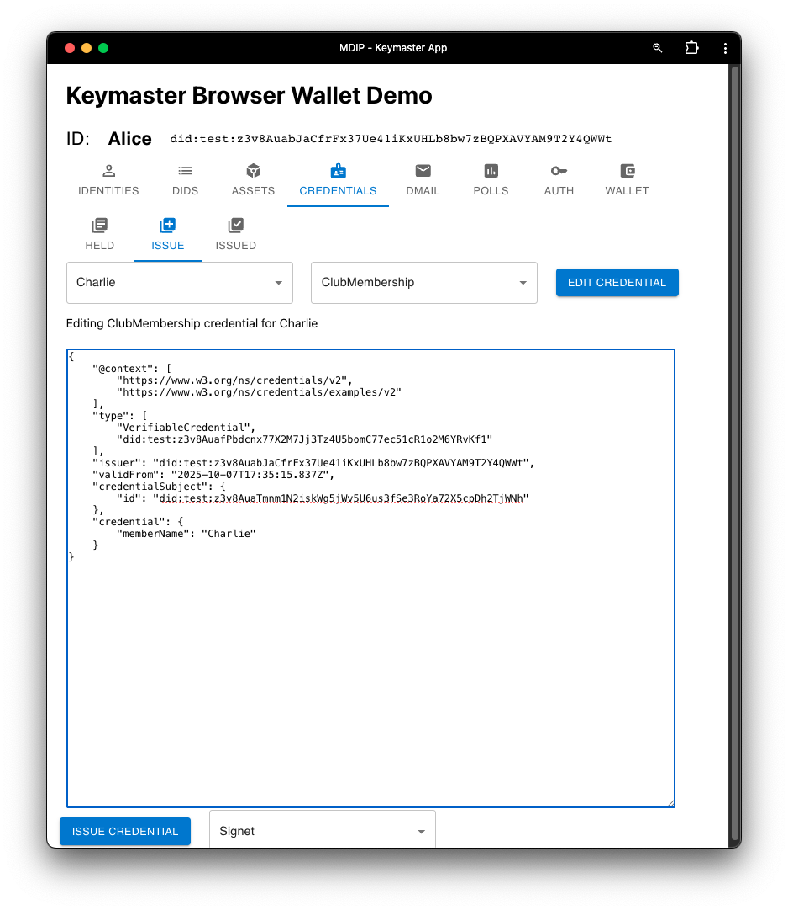
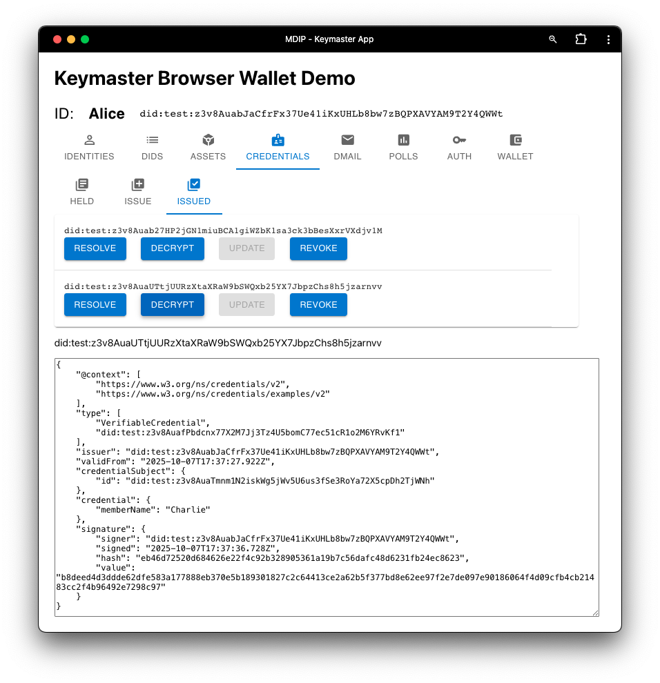
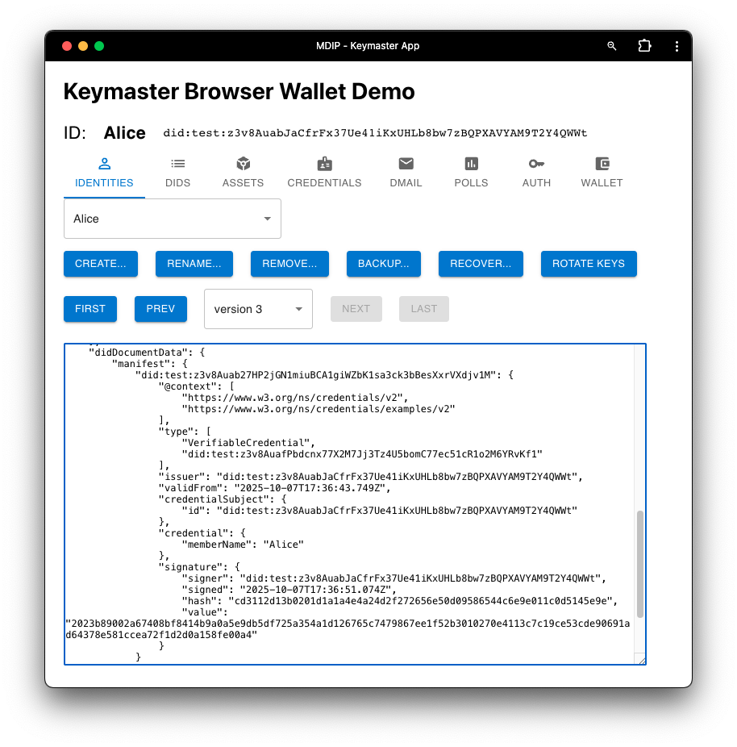

The Credentials screen allows a user to accept and issue fully P2P Verifiable Credentials. Users must first register a schema on the MDIP network, or select an existing schema DID, before a credential can be issued.

The credential subjects are listed from known Agent DIDs contained in the wallet (from the [IDENTITIES](./identities) and [DIDS](./dids) screens).

The credential screen also allows the issuing user to fill in the credential with recipient-specific content. In the credential Alice creates a VC that attests a memberName to Charlie's Agent DID.

## ISSUED Screen

In the "ISSUED" Credentials screen, a user can manage the VCs they issued.

## HELD Screen

In the "HELD" Credentials screen, a user can chose from a variety of options:

- **Resolve**: This will display the *public* (encrypted) view of the credential. Resolving a credential confirms it exists in the MDIP Gatekeeper node.

- **Decrypt**: If the credential is encrypted to the current DID, this will decrypt the cypher_receiver field using the DID keys.

- **Remove**: This removes a credential from the user's wallet.

- **Publish**: This publishes the existence of the credential to the DID manifest, which is visible to the public. The content of the credential is nulled, but the header contains valuable information, notably the DID of the issuer and the DID of the credential schema.

- **Reveal**: This reveals the full content of a credential to the DID manifest, which is visible to the public. The content of the credential is decrypted and included in the DID manifest.

- **Unpublish**: This removes the credential from a DID manifest. Note: other nodes on the network may retain the *history* of a DID; once published or revealed a credential has been winessed by other nodes.

The image below shows a portion of Alice's Agent DID with a revealed membership Verifiable Credential in the Manifest section of her DID document:

