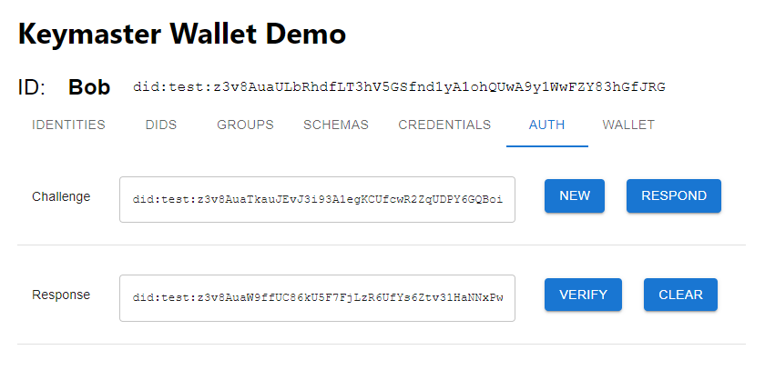

The Authentication screen allows a user to issue and/or respond to MDIP challenges. A challenge DID is entered (or generated) to the **Challenge** text field; a user can create a Response DID to the provided challenge. The response to a challenge will prove to the challenger that the responder conrols the private keys of a particular DID.

MDIP Authentication is secure, like 2FA, because it involves more than 1 channel of communication for authenticating a user.

MDIP Authentication is private, unlike OAuth, because it does not expose authentication events to 3rd parties.

