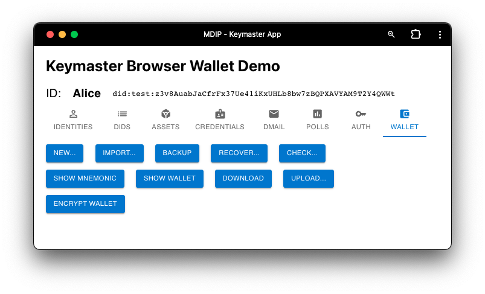

The Wallet screen allows a user to backup their wallet. 

Three different backup / restore paths are provided:

- Download / Upload of a wallet to / from local storage.
- Recover a wallet's keys from a 12-words mnemonic.
- Restore a wallet's content from an encrypted on-network backup.

