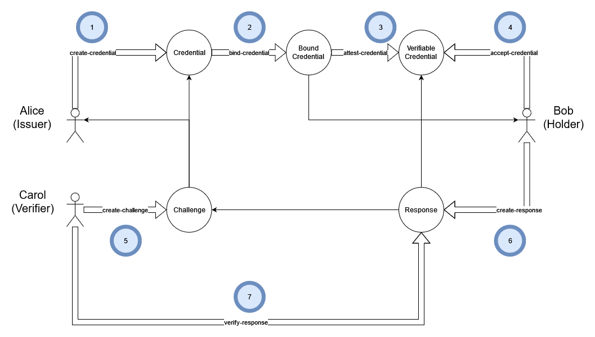

# Keychain-MDIP CLI User Manual

The CLI is a Command Line Interface to the Keychain implementation of the MultiDimensional Identity Protocol (MDIP). `kc` (short for KeyChain) is a script invoked in a unix-like terminal environment (bash, zsh, etc).

## Working with the CLI

The Keychain-MDIP CLI is a user-facing tool used to interact with the MDIP sub-systems and networks.

The Keychain CLI brings together functionality from three important sub-components:

1. Decentralized Identity (DID) registration and management as defined by W3C DID Core.
1. Verifiable Credential (VC) attestation and management as defined by W3C VC Data Model.
1. Crypto keys and wallet management.

All the CLI commands are self-documented using the `--help` flag, or by running `kc` with no flags:

<details>

<summary><code>kc --help</code></summary>

```sh
Usage: keychain-cli [options] [command]

Keychain CLI tool

Options:
  -V, --version                               output the version number
  -h, --help                                  display help for command

Commands:
  accept-credential <did> [name]              Save verifiable credential for current ID
  add-name <name> <did>                       Adds a name for a DID
  attest-credential <file> [registry] [name]  Sign and encrypt a bound credential file
  backup-id                                   Backup the current ID to its registry
  backup-wallet                               Backup wallet to encrypted DID
  bind-credential <file> <did>                Create bound credential for a user
  create-challenge [file] [name]              Create challenge (optionally from a file)
  create-challenge-cc <did> [name]            Create challenge from a credential DID
  create-credential <file> [name]             Create credential from schema file
  create-id <name> [registry]                 Create a new decentralized ID
  create-response <challenge>                 Create a Verifiable Presentation from a challenge
  create-wallet                               Create new wallet (or show existing wallet)
  decrypt-did <did>                           Decrypt an encrypted message DID
  decrypt-json <did>                          Decrypt an encrypted JSON DID
  encrypt-file <file> <did>                   Encrypt a file for a DID
  encrypt-msg <msg> <did>                     Encrypt a message for a DID
  export-did <did>                            Export DID to file
  help [command]                              display help for command
  import-did <file>                           Import DID from file
  import-wallet <recovery-phrase>             Create new wallet from a recovery phrase
  list-ids                                    List IDs and show current ID
  list-names                                  Lists names of DIDs
  publish-credential <did>                    Publish the existence of a credential to the current user manifest
  recover-id <did>                            Recovers the ID from the DID
  recover-wallet <did>                        Recover wallet from encrypted DID
  remove-id <name>                            Deletes named ID
  remove-name <name>                          Removes a name for a DID
  resolve-did <did>                           Return document associated with DID
  resolve-id                                  Resolves the current ID
  reveal-credential <did>                     Reveal a credential to the current user manifest
  revoke-credential <did>                     Revokes a verifiable credential
  rotate-keys                                 Rotates keys for current user
  show-mnemonic                               Show recovery phrase for wallet
  show-wallet                                 Show wallet
  sign-file <file>                            Sign a JSON file
  unpublish-credential <did>                  Remove a credential from the current user manifest
  use-id <name>                               Set the current ID
  verify-file <file>                          Verify the signature in a JSON file
  verify-response <did>                       Decrypt and validate a Verifiable Presentation
```

</details>

## Quick Start


The following examples use a `$` to denote the shell prompt:

```sh
$ kc
```

> [!NOTE]
Unless you edit your shell's `$PATH` variable, you need to invoke kc with a `./` prefix to run the script in the current directory:

```sh
$ ./kc
```

Begin by creating a new identity. This will be described in more detail later, but try it now with your own first name:

```sh
$ kc create-id yourName
did:mdip:test:z3v8AuaYd1CGfC6PCQDXKyKkbt5kJ4o3h2ABBNPGyGNQfEQ99Ce
```

The long string returned starting with `did` will be unique to you. This is your new Decentralized IDentity (DID for short).

Think of a DID as a secure reference. Only the owner of the reference can change what it points to. What makes it decentralized is that anyone can discover what it points to without involving a third party.

Creating a new ID automatically creates a new wallet for your ID, which we will describe next.

## Working with Wallets

> [!warning]
The Keychain CLI wallet is only to be used for experimental and development purposes.

The Keychain CLI wallet is not encrypted and is stored on the local user's file system. Future MDIP wallets will implement additional capabilities (ex: SIWYS). 3rd party wallet developers will also be invited to create MDIP-compatible user wallet implementations.

### What is a Wallet?

The wallet contains a user's private data, including secret keys and associated DIDs. The Keychain-CLI wallet also includes a user's locally named alias for each identity DID.

### Creating a Wallet

Creating a wallet generates a unique seed that is used to derive a hierarchical-deterministic key-pair. This key-pair will be used to generate new unique key-pairs for each future DID generated using this wallet:

> [!NOTE]
`kc create-wallet` does nothing when you already have a wallet, like the one created by `create-id` above.

```json
$ kc create-wallet
{
    "seed": {
        "mnemonic": "P6f40acil4qA1oIHhoK_qNfBPjvdiTn8djxLtcIGMmu5ojQ0g-fAGLLn33Ix5TavvQTzvc6kXax509bQBZZiXjb7ibTToGyUn0oPeBvSV0RcvHOSXWRmATqIqd7dpQrdXqWAwVuxeQ3vy95e2NU",
        "hdkey": {
            "xpriv": "xprv9s21ZrQH143K2x2kGfQ7tgaVHZYQkQVQKbuHgQ4wG7qjfsBoMQD35Ly6rupdEDED1ZBWKtRGWnjwcf9Wxbyvwn4idCPe1kayCrBoLAp8Hvb",
            "xpub": "xpub661MyMwAqRbcFS7DNgw8FpXDqbNu9sDFgpptUnUYpTNiYfWwtwXHd9HaiD1pEfLtMGVBKpCR9D6Vtriqkv7co4W72stnzpLdxPRmuLWJUHS"
        }
    },
    "counter": 0,
    "ids": {}
}
```

Use the command `show-wallet` to view the contents of your wallet; initially, the wallet is empty, but we will see private content added to the wallet as we create MDIP identities and operations:

```json
$ kc show-wallet
{
    "seed": {
        "mnemonic": "BeSI1tnY5TtWweCdEHESV98MXc8CUCu0pFNZ1tLR-0XaP9PvtCcbcUrGfwwIy4qakOkL0hT88xl4Ko3SXbL3U6pEBY4rcROqEwnUuKUN2z9Dx4nKGNz29SDy1GaLV14NbYc1AEa01TEULJr1xzD5",
        "hdkey": {
            "xpriv": "xprv9s21ZrQH143K3MtcqnFrvMQKXVjV37BpYtZo47Vpy9xt44godPRrhcHgrejDPhBCnBk2K8z6CRzPGMDmeDmQGeuDsFwkmE14mrTEv4R33xy",
            "xpub": "xpub661MyMwAqRbcFqy5wonsHVM45XZySZufv7VPrVuSXVVrvs1xAvk7FQcAhxLja5tXXhAv3nPqqftr3E7TmfbUKRXohhHb53N7AiN1iQvwa8p"
        }
    },
    "counter": 0,
    "ids": {}
}
```

### Backing Up and Recovering a Wallet

To recover a wallet from a backup, you need two pieces of information:
- the seed phrase, aka mnemonic,
- the backup DID.

The mnemonic consists of 12 short words (BIP-39) that are used to generate the wallet's private keys:

```sh
$ kc show-mnemonic
know soon mind pen polar pulse patient salmon wage friend equip rotate
```

Creating a wallet backup encrypts the current state of a user wallet content in a DID Document:

```sh
$ kc backup-wallet
did:mdip:test:z3v8Auairrc7XjSdoA1QvuytZXmGdmjcaFsPb2xKjM6TzowPKRn
```

If you lose the wallet file, you can regenerate the private keys from the mnemonic:

```json
$ kc import-wallet "know soon mind pen polar pulse patient salmon wage friend equip rotate"
{
    "seed": {
        "mnemonic": "8PnD0nzyjd9TphttasCFXg_HNDntYdQlx_JHG6Y8K-U7nZUmkxeB4BLYv8xA9af-r6OChSul1Lp6gRPve7qnU_pOVTOE9c7qew-X7Nv_Vd6by-3IxI03ryHkgNjNTOxHlA6iae0D9wA6sFak",
        "hdkey": {
            "xpriv": "xprv9s21ZrQH143K4Yd3NBDr5kALF4foaGBbiocmBv9UuMeet9urHgi1LKaB51ud1SrRtfxhtbRTxjjTQMQei1BewYnBVnu3Wp5G13Ab768K7qF",
            "xpub": "xpub661MyMwAqRbcH2hWUCkrSt74o6WHyiuT62YMzJZ6ThBdkxEzqE2Ft7tevKxzKH4xLdXpUqd32whgcTE3TJTmCgJYqoXvXn6sdaEsWAUCBbZ"
        }
    },
    "counter": 0,
    "ids": {}
}
```

Once a wallet's keys are recreated from the mnemonic, you can recover its contents from a backup DID generated using the backup process above:

```json
$ kc recover-wallet did:mdip:z3v8AuaXcTg74E4nWXDkX3wtZXjGjvp55z7QYixWSUHyG89qFTy
{
    "seed": {
        "mnemonic": "P6f40acil4qA1oIHhoK_qNfBPjvdiTn8djxLtcIGMmu5ojQ0g-fAGLLn33Ix5TavvQTzvc6kXax509bQBZZiXjb7ibTToGyUn0oPeBvSV0RcvHOSXWRmATqIqd7dpQrdXqWAwVuxeQ3vy95e2NU",
        "hdkey": {
            "xpriv": "xprv9s21ZrQH143K2x2kGfQ7tgaVHZYQkQVQKbuHgQ4wG7qjfsBoMQD35Ly6rupdEDED1ZBWKtRGWnjwcf9Wxbyvwn4idCPe1kayCrBoLAp8Hvb",
            "xpub": "xpub661MyMwAqRbcFS7DNgw8FpXDqbNu9sDFgpptUnUYpTNiYfWwtwXHd9HaiD1pEfLtMGVBKpCR9D6Vtriqkv7co4W72stnzpLdxPRmuLWJUHS"
        }
    },
    "counter": 1,
    "ids": {
        "extropy": {
            "did": "did:mdip:test:z3v8AuaiyHqG3KMpcoBoqvUpMrtCsGsu8iPU1oTEfcsUNxtGyt4",
            "account": 0,
            "index": 0
        }
    },
    "current": "extropy"
}
```

`recover-wallet` does not overwrite the existing wallet, it only prints the contents of the backup. The output should be redirected to a temporary `wallet.json` file, which can then be copied over the existing wallet in the `./data` folder.

Do not redirect or pipe the output directly to the existing `wallet.json` file, which will cause an error.

## Working with IDs

The identity operations below meet the specifications defined by [W3C DID Core](https://www.w3.org/TR/did-core/).

### What is an ID?

An ID (identity) refers to the digital identification of an agent DID stored in a user wallet. The user can create new identities on demand, locally, at no cost and with no need of any networking capabilities. An identity's agent DID can be registered with a supported DID registry.

We see examples of these DIDs throughout this document. An MDIP DID example looks like this:

`did:mdip:z3v8AuagsGQwffFd2oVhkdcTWRBi2ps5FdRAJD4jzEVMszkYBCj`

### Creating an ID

Creating a new agent DID uses the wallet's key-pairs to generate a new DID identifier:

```sh
$ kc create-id Alice
did:mdip:test:z3v8AuabRm9DaiakqbwFPgsLd6vSYBQtdj7poQFGYBgsZCfqTvY
```

The new DID and associated name are stored the user's private wallet:

```json
$ kc show-wallet
{
    "seed": {
        "mnemonic": "MLPxAgU1ym_v_YR2Q6-nY47L8xxMqbJqG_NzRNBh3_MHcZ4QQA2x3DI4fSAG2g-XHC3M_EGtmqY6NhVpsC9yKysFYQmcqjm7cAknpJajZYCVlVs7hJPRLdOqkpy4eotTVblgZdYsYtcgbU9kmYc",
        "hdkey": {
            "xpriv": "xprv9s21ZrQH143K2x2kGfQ7tgaVHZYQkQVQKbuHgQ4wG7qjfsBoMQD35Ly6rupdEDED1ZBWKtRGWnjwcf9Wxbyvwn4idCPe1kayCrBoLAp8Hvb",
            "xpub": "xpub661MyMwAqRbcFS7DNgw8FpXDqbNu9sDFgpptUnUYpTNiYfWwtwXHd9HaiD1pEfLtMGVBKpCR9D6Vtriqkv7co4W72stnzpLdxPRmuLWJUHS"
        }
    },
    "counter": 1,
    "ids": {
        "Alice": {
            "did": "did:mdip:test:z3v8AuabRm9DaiakqbwFPgsLd6vSYBQtdj7poQFGYBgsZCfqTvY",
            "account": 0,
            "index": 0
        }
    },
    "current": "Alice"
}
```

The new DID can also be registered on any MDIP registry the user chooses.

### Resolve Current Agent ID

Resolving an ID means fetching the documents associated with an ID. The current CLI user's agent documents can be displayed using the command `kc resolve-id` without a DID argument:

```json
$ kc resolve-id
{
    "@context": "https://w3id.org/did-resolution/v1",
    "didDocument": {
        "@context": [
            "https://www.w3.org/ns/did/v1"
        ],
        "id": "did:mdip:test:z3v8AuabRm9DaiakqbwFPgsLd6vSYBQtdj7poQFGYBgsZCfqTvY",
        "verificationMethod": [
            {
                "id": "#key-1",
                "controller": "did:mdip:test:z3v8AuabRm9DaiakqbwFPgsLd6vSYBQtdj7poQFGYBgsZCfqTvY",
                "type": "EcdsaSecp256k1VerificationKey2019",
                "publicKeyJwk": {
                    "crv": "secp256k1",
                    "kty": "EC",
                    "x": "3tJzOiiSFhDIzMcg_YGLtzvBjs5L9DhBvRmUZVEbV5c",
                    "y": "eVUruQfrt1Fx_m2CW7t0KHrRk-JlHzgZLY6LPC3lgjU"
                }
            }
        ],
        "authentication": [
            "#key-1"
        ]
    },
    "didDocumentMetadata": {
        "created": "2024-03-22T14:48:41.213Z"
    },
    "didDocumentData": {},
    "mdip": {
        "registry": "hyperswarm",
        "type": "agent",
        "version": 1
    }
}
```

### Backing up an ID

Backing up an identity is the process of posting an encrypted document DID to the identity's vault. The vault DID document contains the encrypted history of the identity at the time of the backup, enabling recovery of all Verifiable Credentials (VCs) associated with the DID:

```sh
$ kc backup-id
OK
```

After running `backup-id`, note the new `vault` key in the agent document:

```json
$ kc resolve-id
{
    "@context": "https://w3id.org/did-resolution/v1",
    "didDocument": {
        "@context": [
            "https://www.w3.org/ns/did/v1"
        ],
        "id": "did:mdip:test:z3v8AuabRm9DaiakqbwFPgsLd6vSYBQtdj7poQFGYBgsZCfqTvY",

    ...

    "didDocumentData": {
        "vault": "did:mdip:test:z3v8AuafhKoRuEkDTjyoabgPXKx4Yi4cPmPdzUgMNyKxkzYNA6u"
    },
    
    ...

}
```

Note that each wallet and each identity have their own backups. This will allow the user to chose a different MDIP registry (or no registry) with different security or permanence attributes for a particular identity (ie: some DIDs will be more valuable than others to the user).

### Removing an ID

At any time, a user may remove a named DID from their wallet:

```sh
$ kc remove-id Alice
ID Alice removed
```

### Recovering an ID

Recovery of a DID's history using the Vault DID is possible because the Vault data is encrypted with the wallet's keys. The wallet keys are used to decrypt the Vault DID data containing the DID's private history:

```sh
$ kc recover-id did:mdip:test:z3v8AuabRm9DaiakqbwFPgsLd6vSYBQtdj7poQFGYBgsZCfqTvY
Recovered Alice!
```

### Listing IDs

A user's wallet may contain any number of MDIP agent DID identities:

```sh
$ kc create-id Bob
did:mdip:test:z3v8AuairhLoGZqf6UDKw7zXyBknTvanvSzFHnLpwy8nwa7WLzk
```

```sh
$ kc list-ids
Alice
Bob  <<< current
```

### Switching IDs

A user can switch between their various MDIP identities:

```sh
$kc use-id Alice
OK
```

```sh
$ kc list-ids
Alice  <<< current
Bob
```

### Rotating an ID's Keys

A user can rotate the public keys associated with a particular DID. This is a common privacy and security feature that allows the user to keep the same DID but sign future documents with new keys.

The command `rotate-keys` rotates the keys of the wallet's currently active user id:

```json
$ kc rotate-keys
{
    "@context": "https://w3id.org/did-resolution/v1",
    "didDocument": {
        "@context": [
            "https://www.w3.org/ns/did/v1"
        ],
        "id": "did:mdip:test:z3v8AuabRm9DaiakqbwFPgsLd6vSYBQtdj7poQFGYBgsZCfqTvY",
        "verificationMethod": [
            {
                "id": "#key-2",
                "controller": "did:mdip:test:z3v8AuabRm9DaiakqbwFPgsLd6vSYBQtdj7poQFGYBgsZCfqTvY",
                "type": "EcdsaSecp256k1VerificationKey2019",
                "publicKeyJwk": {
                    "kty": "EC",
                    "crv": "secp256k1",
                    "x": "e3j21wCPrDSUiY4fQaPYYNLZ-7wcOI6d_WcLy3RTSWc",
                    "y": "9-kZlDiwShHihazR15z9VYEIks9W3PKdt0Cae7FJFA4"
                }
            }
        ],
        "authentication": [
            "#key-2"
        ]
    },
    "didDocumentMetadata": {
        "created": "2024-03-22T14:48:41.213Z",
        "updated": "2024-03-22T14:53:23.565Z"
    },
    "didDocumentData": {
        "vault": "did:mdip:test:z3v8AuafhKoRuEkDTjyoabgPXKx4Yi4cPmPdzUgMNyKxkzYNA6u"
    },
    "mdip": {
        "registry": "hyperswarm",
        "type": "agent",
        "version": 1
    }
}
```

## Working with DIDs

### What is a DID

A Decentralized Identifier (DID) is a standardized document to define a digital identity. DIDs are designed to be decentralized, not requiring a specific identity provider or certificate authority. For more detailed information, see the W3C's [documentation](https://www.w3.org/TR/did-core/) documentation.

### Resolving a DID

Resolving a DID means fetching the documents associated with a DID. The documents are returns in a single JSON object.

This example returns a Credential object that includes a schema in its `didDocumentData`:

```json
$ ./kc resolve-did did:mdip:test:z3v8AuaYLYSWZJUa4bSadeoiNA3ps8dWDYtsmJNMDJhbFDjaKaX
{
    "@context": "https://w3id.org/did-resolution/v1",
    "didDocument": {
        "@context": [
            "https://www.w3.org/ns/did/v1"
        ],
        "id": "did:mdip:test:z3v8AuaYLYSWZJUa4bSadeoiNA3ps8dWDYtsmJNMDJhbFDjaKaX",
        "controller": "did:mdip:test:z3v8AuaaBKfwrt2Y7AAbDaGqLNgyn1BDhP7wUFpEMEngmwYwi17"
    },
    "didDocumentMetadata": {
        "created": "2024-03-21T20:26:01.826Z"
    },
    "didDocumentData": {
        "$schema": "http://json-schema.org/draft-07/schema#",
        "properties": {
            "account": {
                "format": "uri",
                "type": "string"
            },
            "service": {
                "type": "string"
            }
        },
        "required": [
            "service",
            "account"
        ],
        "type": "object"
    },
    "mdip": {
        "registry": "hyperswarm",
        "type": "asset",
        "version": 1
    }
}
```

### Exporting an DID

For offline and off-network use, a DID can be exported to file so it can be stored or transported offline. The `export-did` command can be used to export any DID, including both agent or asset documents. The resulting output will include the entire history of a DID, including prior versions of keys:

```json
$ kc export-did did:mdip:z3v8AuagbRf9UrW7AQQqHCGejPYafoczuQ5uTuF3mFuc5vEMUkj
[
    {
        "time": "2024-03-13T17:38:54.926Z",
        "ordinal": 0,
        "did": "did:mdip:z3v8AuagsGQwffFd2oVhkdcTWRBi2ps5FdRAJD4jzEVMszkYBCj",
        "txn": {
            "op": "create",
            "created": "2024-03-13T17:38:54.926Z",
(...) #Lots of DID history goes here...
            "prev": "523f72b65b66cc3a829a1bf6a0ec058aea29af0f8d2f7fdd1938d282abe6efc4",
            "signature": {
                "signer": "did:mdip:z3v8AuagsGQwffFd2oVhkdcTWRBi2ps5FdRAJD4jzEVMszkYBCj",
                "signed": "2024-03-13T18:30:20.353Z",
                "hash": "5a226a2899c579e5d99055a1d1a2f39a41a8ab44a4891e248fb94d8c44f4e67a",
                "value": "9938df3ed8114d4bf1a78d2829d0ee22d17d7ffb0aa9eef46f2fbf386a9ae8a2158d3555c5495e04c9bd45d1ea090758c4ec30e23703988fe3a5780c62da906d"
            }
        }
    }
]
```

### Importing an DID

For offline and off-network use, a DID can be imported from a file so it can be stored on a new node's registry. The `import-did` command will import DIDs exported by the `export-did` command:

```sh
$ kc import-did exported-DID-file.json
1
```

## Working with Credentials

The credential operations below meet the specifications defined in [W3C VC Data Model](https://www.w3.org/TR/vc-data-model/).

### What is a Credential?

From W3C:
> Credentials are a part of our daily lives; driver's licenses are used to assert that we are capable of operating a motor vehicle, university degrees can be used to assert our level of education, and government-issued passports enable us to travel between countries. These credentials provide benefits to us when used in the physical world, but their use on the Web continues to be elusive.
>
> \- [Source](https://www.w3.org/TR/vc-data-model/#abstract)

### What is a Verifiable Credential?

From W3C:
> A verifiable credential (VC) can represent all of the same information that a physical credential represents. The addition of technologies, such as digital signatures, makes verifiable credentials more tamper-evident and more trustworthy than their physical counterparts.
>
> \- [Source](https://www.w3.org/TR/vc-data-model/#what-is-a-verifiable-credential)

### MDIP Verifiable Credential Basic Workflow



The basic workflow involves three actors: Alice (the Issuer), Bob (the Holder), and Carol (the Verifier). In this scenario, Bob wishes to gain access to some resource controlled by Carol. Carol will grant Bob access only if Bob can prove that he owns a particular credential issued by Alice.

#### Steps to Creating a VC:

1. The Issuer (Alice) creates a Credential. The Credential is like a type or a class; it describes the Credential, and specifies a schema. Each Verified Credential is an instance of a Credential.
1. The Issuer binds a Credential to a Holder
1. The Issuer attest a Credential, creating a Verifiable Credential (VC),  by signing and encrypting a Bound Credential.
1. The Holder (Bob) accepts the VC (adding it to their wallet for future use).
1. The Verifier (Carol) creates a Challenge. A Challenge is a list of Credentials and trusted Issuers.
1. The Holder creates a Response to the Challenge. A Response contains a list of Verified Presentations that correspond to the Credentials and trusted Issuers listed in the Challenge. If the User's wallet contains the right Verified Credentials, then it will be possible to create a valid Response to the Challenge. The Response is encrypted for the Verifier.
1. The Verifier validates the Response. The Response is verified by checking that it contains a Verified Presentation for every Credential in the Challenge,  that the VP is issued by a trusted Issuer, and that the VC corresponding the VP has not been revoked. If everything checks out the Response is accepted and the Holder is granted authorization.

### Preparing or Selecting a Credential Schema File

JSON Schemas are ubiquitous. The schema defines the content of a future credential. Standardized schemas (ex: schema.org) for common credentials (ex: address, membership, etc) should be used to facilitate data interoperability.

```json
$ cat data/schema/social-media.json
{
    "$schema": "http://json-schema.org/draft-07/schema#",
    "type": "object",
    "properties": {
        "service": {
            "type": "string"
        },
        "account": {
            "type": "string",
            "format": "uri"
        }
    },
    "required": [
        "service",
        "account"
    ]
}
```

### Creating a Credential DID

MDIP-compatible credentials are created using a JSON schema file as a template. The schema file will be registered with a Gatekeeper to create the Credential and receive its associated DID.

```sh
$ kc create-credential data/schema/social-media.json social-media
did:mdip:test:z3v8AuaeAPf9JMuyYZ1D79D626uUzDQmRPwq4d8oB1Th6ztzAS7
```

```json
$ kc list-names
{
    "social-media": "did:mdip:test:z3v8AuaeAPf9JMuyYZ1D79D626uUzDQmRPwq4d8oB1Th6ztzAS7"
}
```

```json
$ kc resolve-did social-media
{
    "@context": "https://w3id.org/did-resolution/v1",
    "didDocument": {
        "@context": [
            "https://www.w3.org/ns/did/v1"
        ],
        "id": "did:mdip:test:z3v8AuaeAPf9JMuyYZ1D79D626uUzDQmRPwq4d8oB1Th6ztzAS7",
        "controller": "did:mdip:test:z3v8AuabRm9DaiakqbwFPgsLd6vSYBQtdj7poQFGYBgsZCfqTvY"
    },
    "didDocumentMetadata": {
        "created": "2024-03-22T15:00:31.047Z"
    },
    "didDocumentData": {
        "$schema": "http://json-schema.org/draft-07/schema#",
        "properties": {
            "account": {
                "format": "uri",
                "type": "string"
            },
            "service": {
                "type": "string"
            }
        },
        "required": [
            "service",
            "account"
        ],
        "type": "object"
    },
    "mdip": {
        "registry": "hyperswarm",
        "type": "asset",
        "version": 1
    }
}
```

The command above created a DID document with the schema file provided. For convenience, the user's wallet now contains a named alias (social-media) to the new credential's DID.

### Binding the Credential

The Credential DID must now be bound to the Agent DID who is to become the Subject of the new credential. The binding process will generate a credential in JSON form that will be pre-populated with the DIDs of subject, issuer and credential type.

In the command below, both `social-media` and `Bob`  are resolved to their respective DIDs using the named alias and identity names from the user's private wallet:

```json
$ kc bind-credential social-media Bob
{
    "@context": [
        "https://www.w3.org/ns/credentials/v2",
        "https://www.w3.org/ns/credentials/examples/v2"
    ],
    "type": [
        "VerifiableCredential",
        "did:mdip:test:z3v8AuaeAPf9JMuyYZ1D79D626uUzDQmRPwq4d8oB1Th6ztzAS7"
    ],
    "issuer": "did:mdip:test:z3v8AuabRm9DaiakqbwFPgsLd6vSYBQtdj7poQFGYBgsZCfqTvY",
    "validFrom": "2024-03-22T15:04:33.684Z",
    "validUntil": null,
    "credentialSubject": {
        "id": "did:mdip:test:z3v8AuairhLoGZqf6UDKw7zXyBknTvanvSzFHnLpwy8nwa7WLzk"
    },
    "credential": {
        "account": "http://yNtjneCOyzLGUNtiAK.wnarGe6zodO-cGG47CGWl66-kvLbKVHCrFQPFy-ihIYfNlEuc",
        "service": "in sit aliquip"
    }
}
```

This JSON Bound Credential does not yet contain user-specific information other than the DID. The binding process pre-filled the required fields (account and service)with dummy data to be replaced in next step.

### Editing the Credential

The bound credential must be populated with holder-specific information. This step will typically be automated in most deployments. In the case of our social media schema, we must populate a service field with the name of an online social media provider, and we must populate the account field with a URL to the holder's specific social media account.

```sh
$ kc bind-credential social-media Bob > bob-twitter.json
(output sent to the bob-twitter.json file)
```

Edit the `bob-twitter.json` file to populate the `credential.account` and `credential.service` fields with information that is pertinent with the subject of the credential:

```sh
$ cat bob-twitter.json
{
    "@context": [
        "`https://`www.`w3.org`/ns/credentials/v2",
        "https://www.w3.org/ns/credentials/examples/v2"
    ],
    "type": [
        "VerifiableCredential",
        "did:mdip:test:z3v8AuaeAPf9JMuyYZ1D79D626uUzDQmRPwq4d8oB1Th6ztzAS7"
    ],
    "issuer": "did:mdip:test:z3v8AuabRm9DaiakqbwFPgsLd6vSYBQtdj7poQFGYBgsZCfqTvY",
    "validFrom": "2024-03-22T15:06:24.773Z",
    "validUntil": null,
    "credentialSubject": {
        "id": "did:mdip:test:z3v8AuairhLoGZqf6UDKw7zXyBknTvanvSzFHnLpwy8nwa7WLzk"
    },
    "credential": {
        "account": "https://twitter.com/bob",
        "service": "twitter.com"
    }
}
```

### Attesting a credential

The credential, bound and populated with the subject's information, must now be signed by the issuer and encrypted to the subject's keys:

```sh
$ kc attest-credential bob-twitter.json
did:mdip:test:z3v8AuaZAWJuERtD5CwDu2mNpLHjJ6imdNGTwdZpfKY6FK5ASk2
```

The issuer (Alice) should now send the VC's DID to the subject (Bob).

### Verifying a credential

Only the issuer and holder of a VC can verify it since it is encrypted. When Bob receives the credential from Alice, he can view its contents before accepting it:

```json
$ kc decrypt-json did:mdip:test:z3v8AuaZAWJuERtD5CwDu2mNpLHjJ6imdNGTwdZpfKY6FK5ASk2
{
    "@context": [
        "https://www.w3.org/ns/credentials/v2",
        "https://www.w3.org/ns/credentials/examples/v2"
    ],
    "type": [
        "VerifiableCredential",
        "did:mdip:test:z3v8AuaeAPf9JMuyYZ1D79D626uUzDQmRPwq4d8oB1Th6ztzAS7"
    ],
    "issuer": "did:mdip:test:z3v8AuabRm9DaiakqbwFPgsLd6vSYBQtdj7poQFGYBgsZCfqTvY",
    "validFrom": "2024-03-22T15:06:24.773Z",
    "validUntil": null,
    "credentialSubject": {
        "id": "did:mdip:test:z3v8AuairhLoGZqf6UDKw7zXyBknTvanvSzFHnLpwy8nwa7WLzk"
    },
    "credential": {
        "account": "https://twitter.com/bob",
        "service": "twitter.com"
    },
    "signature": {
        "signer": "did:mdip:test:z3v8AuabRm9DaiakqbwFPgsLd6vSYBQtdj7poQFGYBgsZCfqTvY",
        "signed": "2024-03-22T15:09:02.994Z",
        "hash": "62f7cb1a31d338d29287f9ce91b4da103391dca88b853ea1b05920c6049ae8ff",
        "value": "37941a42492a431ceaff91c86de55eb0cd3ed98107a3ce19a76d88511b7fe2bc6fcf298c69e431b048ab0786e9624b647e4d03a4c26031c4c6e2b6882223defe"
    }
}
```

### Accepting a credential

Accepting a credential adds the DID to the user's local wallet:

```sh
$ kc accept-credential did:mdip:test:z3v8AuaZAWJuERtD5CwDu2mNpLHjJ6imdNGTwdZpfKY6FK5ASk2
OK saved
```

```json
$ kc show-wallet
{
    "seed": {
        "mnemonic": "MLPxAgU1ym_v_YR2Q6-nY47L8xxMqbJqG_NzRNBh3_MHcZ4QQA2x3DI4fSAG2g-XHC3M_EGtmqY6NhVpsC9yKysFYQmcqjm7cAknpJajZYCVlVs7hJPRLdOqkpy4eotTVblgZdYsYtcgbU9kmYc",
        "hdkey": {
            "xpriv": "xprv9s21ZrQH143K2x2kGfQ7tgaVHZYQkQVQKbuHgQ4wG7qjfsBoMQD35Ly6rupdEDED1ZBWKtRGWnjwcf9Wxbyvwn4idCPe1kayCrBoLAp8Hvb",
            "xpub": "xpub661MyMwAqRbcFS7DNgw8FpXDqbNu9sDFgpptUnUYpTNiYfWwtwXHd9HaiD1pEfLtMGVBKpCR9D6Vtriqkv7co4W72stnzpLdxPRmuLWJUHS"
        }
    },
    "counter": 3,
    "ids": {
        "Alice": {
            "did": "did:mdip:test:z3v8AuabRm9DaiakqbwFPgsLd6vSYBQtdj7poQFGYBgsZCfqTvY",
            "account": 0,
            "index": 1,
            "owned": [
                "did:mdip:test:z3v8AuaeAPf9JMuyYZ1D79D626uUzDQmRPwq4d8oB1Th6ztzAS7",
                "did:mdip:test:z3v8AuaZAWJuERtD5CwDu2mNpLHjJ6imdNGTwdZpfKY6FK5ASk2"
            ]
        },
        "Bob": {
            "did": "did:mdip:test:z3v8AuairhLoGZqf6UDKw7zXyBknTvanvSzFHnLpwy8nwa7WLzk",
            "account": 2,
            "index": 0,
            "held": [
                "did:mdip:test:z3v8AuaZAWJuERtD5CwDu2mNpLHjJ6imdNGTwdZpfKY6FK5ASk2"
            ]
        }
    },
    "current": "Bob",
    "names": {
        "social-media": "did:mdip:test:z3v8AuaeAPf9JMuyYZ1D79D626uUzDQmRPwq4d8oB1Th6ztzAS7"
    }
}
```

### Revoking a credential

The issuer of a credential can revoke their attestation at any time. This will blank out the VC's credential content data and set the `didDocumentMetadata.deactivated` property to true.

```sh
$ kc revoke-credential did:mdip:test:z3v8AuaZAWJuERtD5CwDu2mNpLHjJ6imdNGTwdZpfKY6FK5ASk2
OK revoked
```

```json
$ kc resolve-did did:mdip:test:z3v8AuaZAWJuERtD5CwDu2mNpLHjJ6imdNGTwdZpfKY6FK5ASk2
{
    "@context": "https://w3id.org/did-resolution/v1",
    "didDocument": {},
    "didDocumentMetadata": {
        "created": "2024-03-22T15:09:03.056Z",
        "deactivated": true,
        "updated": "2024-03-22T15:17:53.368Z"
    },
    "didDocumentData": {},
    "mdip": {
        "registry": "hyperswarm",
        "type": "asset",
        "version": 1
    }
}
```

## Working with the DID Manifest

### What is the DID Manifest?

The DID Manifest is a public data container that is returned with the DID document data. Users can chose to publish or reveal any attestation they receive. All information in the manifest is publicly viewable.

Example of `didDocumentData` with a manifest :

```json
{
    "manifest": {
        "did:mdip:test:z3v8Auaf3eZEUqJEu8xu1uUwxK3ZTLLXsfg9U7p6awPzyuD1AAT": {
            "@context": [
                "https://www.w3.org/ns/credentials/v2",
                "https://www.w3.org/ns/credentials/examples/v2"
            ],
            "type": [
                "VerifiableCredential",
                "did:mdip:test:z3v8AuaeAPf9JMuyYZ1D79D626uUzDQmRPwq4d8oB1Th6ztzAS7"
            ],
            "issuer": "did:mdip:test:z3v8AuabRm9DaiakqbwFPgsLd6vSYBQtdj7poQFGYBgsZCfqTvY",
            "validFrom": "2024-03-22T15:06:24.773Z",
            "validUntil": null,
            "credentialSubject": {
                "id": "did:mdip:test:z3v8AuairhLoGZqf6UDKw7zXyBknTvanvSzFHnLpwy8nwa7WLzk"
            },
            "credential": null,
            "signature": {
                "signer": "did:mdip:test:z3v8AuabRm9DaiakqbwFPgsLd6vSYBQtdj7poQFGYBgsZCfqTvY",
                "signed": "2024-03-22T18:00:19.405Z",
                "hash": "62f7cb1a31d338d29287f9ce91b4da103391dca88b853ea1b05920c6049ae8ff",
                "value": "37941a42492a431ceaff91c86de55eb0cd3ed98107a3ce19a76d88511b7fe2bc6fcf298c69e431b048ab0786e9624b647e4d03a4c26031c4c6e2b6882223defe"
            }
        }
    }
}
```

### Publishing a Verifiable Credential

Publishing a VC to a DID Manifest will make it known that the DID holder has received a particular Verifiable Credential without revealing the credential's values. In this example, we know that Bob has a social-media attestation, but we do not know the details:

```sh
$ kc add-name bob-twitter did:mdip:test:z3v8Auaf3eZEUqJEu8xu1uUwxK3ZTLLXsfg9U7p6awPzyuD1AAT
OK Saved
```

```json
$ kc publish-credential bob-twitter
{
    "@context": [
        "https://www.w3.org/ns/credentials/v2",
        "https://www.w3.org/ns/credentials/examples/v2"
    ],
    "type": [
        "VerifiableCredential",
        "did:mdip:test:z3v8AuaeAPf9JMuyYZ1D79D626uUzDQmRPwq4d8oB1Th6ztzAS7"
    ],
    "issuer": "did:mdip:test:z3v8AuabRm9DaiakqbwFPgsLd6vSYBQtdj7poQFGYBgsZCfqTvY",
    "validFrom": "2024-03-22T15:06:24.773Z",
    "validUntil": null,
    "credentialSubject": {
        "id": "did:mdip:test:z3v8AuairhLoGZqf6UDKw7zXyBknTvanvSzFHnLpwy8nwa7WLzk"
    },
    "credential": null,
    "signature": {
        "signer": "did:mdip:test:z3v8AuabRm9DaiakqbwFPgsLd6vSYBQtdj7poQFGYBgsZCfqTvY",
        "signed": "2024-03-22T18:00:19.405Z",
        "hash": "62f7cb1a31d338d29287f9ce91b4da103391dca88b853ea1b05920c6049ae8ff",
        "value": "37941a42492a431ceaff91c86de55eb0cd3ed98107a3ce19a76d88511b7fe2bc6fcf298c69e431b048ab0786e9624b647e4d03a4c26031c4c6e2b6882223defe"
    }
}
```

```json
$ kc resolve-id
{
    "@context": "https://w3id.org/did-resolution/v1",
    "didDocument": {
        "@context": [
            "https://www.w3.org/ns/did/v1"
        ],
        "id": "did:mdip:test:z3v8AuairhLoGZqf6UDKw7zXyBknTvanvSzFHnLpwy8nwa7WLzk",
        "verificationMethod": [
            {
                "id": "#key-1",
                "controller": "did:mdip:test:z3v8AuairhLoGZqf6UDKw7zXyBknTvanvSzFHnLpwy8nwa7WLzk",
                "type": "EcdsaSecp256k1VerificationKey2019",
                "publicKeyJwk": {
                    "crv": "secp256k1",
                    "kty": "EC",
                    "x": "IGP1mIaBZPh5QYfvrxxR9JzQWa-hsB4J_bwWwFZjOa4",
                    "y": "wQrOGoP_S5bckp-U8zb2UYxFYM4xLWdIuVZ8c0NRUv4"
                }
            }
        ],
        "authentication": [
            "#key-1"
        ]
    },
    "didDocumentMetadata": {
        "created": "2024-03-22T14:55:27.374Z",
        "updated": "2024-03-22T18:01:00.220Z"
    },
    "didDocumentData": {
        "manifest": {
            "did:mdip:test:z3v8Auaf3eZEUqJEu8xu1uUwxK3ZTLLXsfg9U7p6awPzyuD1AAT": {
                "@context": [
                    "https://www.w3.org/ns/credentials/v2",
                    "https://www.w3.org/ns/credentials/examples/v2"
                ],
                "type": [
                    "VerifiableCredential",
                    "did:mdip:test:z3v8AuaeAPf9JMuyYZ1D79D626uUzDQmRPwq4d8oB1Th6ztzAS7"
                ],
                "issuer": "did:mdip:test:z3v8AuabRm9DaiakqbwFPgsLd6vSYBQtdj7poQFGYBgsZCfqTvY",
                "validFrom": "2024-03-22T15:06:24.773Z",
                "validUntil": null,
                "credentialSubject": {
                    "id": "did:mdip:test:z3v8AuairhLoGZqf6UDKw7zXyBknTvanvSzFHnLpwy8nwa7WLzk"
                },
                "credential": null,
                "signature": {
                    "signer": "did:mdip:test:z3v8AuabRm9DaiakqbwFPgsLd6vSYBQtdj7poQFGYBgsZCfqTvY",
                    "signed": "2024-03-22T18:00:19.405Z",
                    "hash": "62f7cb1a31d338d29287f9ce91b4da103391dca88b853ea1b05920c6049ae8ff",
                    "value": "37941a42492a431ceaff91c86de55eb0cd3ed98107a3ce19a76d88511b7fe2bc6fcf298c69e431b048ab0786e9624b647e4d03a4c26031c4c6e2b6882223defe"
                }
            }
        }
    },
    "mdip": {
        "registry": "hyperswarm",
        "type": "agent",
        "version": 1
    }
}
```

### Revealing a Verifiable Credential

Revealing a VC to a DID Manifest will decrypt and expose the entire VC content to the public:

```json
$ kc reveal-credential bob-twitter
{
    "@context": [
        "https://www.w3.org/ns/credentials/v2",
        "https://www.w3.org/ns/credentials/examples/v2"
    ],
    "type": [
        "VerifiableCredential",
        "did:mdip:test:z3v8AuaeAPf9JMuyYZ1D79D626uUzDQmRPwq4d8oB1Th6ztzAS7"
    ],
    "issuer": "did:mdip:test:z3v8AuabRm9DaiakqbwFPgsLd6vSYBQtdj7poQFGYBgsZCfqTvY",
    "validFrom": "2024-03-22T15:06:24.773Z",
    "validUntil": null,
    "credentialSubject": {
        "id": "did:mdip:test:z3v8AuairhLoGZqf6UDKw7zXyBknTvanvSzFHnLpwy8nwa7WLzk"
    },
    "credential": {
        "account": "https://twitter.com/bob",
        "service": "twitter.com"
    },
    "signature": {
        "signer": "did:mdip:test:z3v8AuabRm9DaiakqbwFPgsLd6vSYBQtdj7poQFGYBgsZCfqTvY",
        "signed": "2024-03-22T18:00:19.405Z",
        "hash": "62f7cb1a31d338d29287f9ce91b4da103391dca88b853ea1b05920c6049ae8ff",
        "value": "37941a42492a431ceaff91c86de55eb0cd3ed98107a3ce19a76d88511b7fe2bc6fcf298c69e431b048ab0786e9624b647e4d03a4c26031c4c6e2b6882223defe"
    }
}
```

### Unpublishing a Verifiable Credential

At any time, a VC holder can decide to remove VCs published on their DID Manifest.

```sh
$ kc unpublish-credential bob-twitter
OK
```

## Working with Challenges and Responses

### What is a challenge and response?

The VC model enables 3rd party entities to issue a Challenge requesting proof from a VC Holder. The VC Holder may respond (at the holder's discretion) with a Verifiable Presentation providing tamper-proof evidence data in response to the Challenge request.

### Creating a Challenge

The challenge is created from a schema file or from an existing DID pointing to an existing schema credential. To create a challenge from a schema file, use `kc create-challenge`; to create a challenge from an existing credential DID, use `kc create-challenge-cc` instead.

```sh
$ kc create-challenge-cc social-media sm-challenge
did:mdip:test:z3v8AuaaxRxwZCPUnpCc4RoV5CZjeYVJepmJTVeJrpvyyB6LmwN
```

In the command above, `social-media` is a named alias in Alice's wallet that resolves to the DID of the social-medial credential in examples above. `sm-challenge` is a new named alias in Alice's wallet that contains the DID of the new challenge document:

```json
$ kc resolve-did sm-challenge
{
    "@context": "https://w3id.org/did-resolution/v1",
    "didDocument": {
        "@context": [
            "https://www.w3.org/ns/did/v1"
        ],
        "id": "did:mdip:test:z3v8AuaaxRxwZCPUnpCc4RoV5CZjeYVJepmJTVeJrpvyyB6LmwN",
        "controller": "did:mdip:test:z3v8AuabRm9DaiakqbwFPgsLd6vSYBQtdj7poQFGYBgsZCfqTvY"
    },
    "didDocumentMetadata": {
        "created": "2024-03-22T18:18:35.413Z"
    },
    "didDocumentData": {
        "credentials": [
            {
                "schema": "did:mdip:test:z3v8AuaeAPf9JMuyYZ1D79D626uUzDQmRPwq4d8oB1Th6ztzAS7"
            }
        ]
    },
    "mdip": {
        "registry": "hyperswarm",
        "type": "asset",
        "version": 1
    }
}
```

### Creating a Verifiable Presentation Response

When presented with a challenge, a user can prepare a Verifiable Presentation of the credentials claims requested in the challenge.

1. The user can first verify that they are using the identity they want to create a Verifiable Presentation for:

    ```sh
    $ kc use-id Bob
    OK
    ```

1. Next, the user can optionally create their own alias to interact with the challenge DID:

    ```sh
    $ kc add-name sm-challenge did:mdip:test:z3v8AuaaxRxwZCPUnpCc4RoV5CZjeYVJepmJTVeJrpvyyB6LmwN
    ```

    > [!NOTE]
If you're testing as both Alice and Bob from a single wallet, you can skip this step.

1. Then the user can create a repsonse:

    ```sh
    $ kc create-response sm-challenge
    did:mdip:test:z3v8AuadZ56m4x2UTpeY3HhSFvFQnrCUyASBYA77vqrqQr9SR99
    ```

The command above mapped the Challenge with previously received VCs and found one matching the request for Bob's twitter account attestation. The resulting DID document contains a Verifiable Presentation revealing the twitter account VC data encrypted to the requesting party (Alice).

### Verifying a VP Response

To verify the response received to a challenge, a user simply passes the DID of the VP received from the VC Holder being challenged.

```json
$ kc use-id Alice
OK
kc verify-response did:mdip:test:z3v8AuadZ56m4x2UTpeY3HhSFvFQnrCUyASBYA77vqrqQr9SR99
[
    {
        "@context": [
            "https://www.w3.org/ns/credentials/v2",
            "https://www.w3.org/ns/credentials/examples/v2"
        ],
        "type": [
            "VerifiableCredential",
            "did:mdip:test:z3v8AuaeAPf9JMuyYZ1D79D626uUzDQmRPwq4d8oB1Th6ztzAS7"
        ],
        "issuer": "did:mdip:test:z3v8AuabRm9DaiakqbwFPgsLd6vSYBQtdj7poQFGYBgsZCfqTvY",
        "validFrom": "2024-03-22T15:06:24.773Z",
        "validUntil": null,
        "credentialSubject": {
            "id": "did:mdip:test:z3v8AuairhLoGZqf6UDKw7zXyBknTvanvSzFHnLpwy8nwa7WLzk"
        },
        "credential": {
            "account": "https://twitter.com/bob",
            "service": "twitter.com"
        },
        "signature": {
            "signer": "did:mdip:test:z3v8AuabRm9DaiakqbwFPgsLd6vSYBQtdj7poQFGYBgsZCfqTvY",
            "signed": "2024-03-22T18:00:19.405Z",
            "hash": "62f7cb1a31d338d29287f9ce91b4da103391dca88b853ea1b05920c6049ae8ff",
            "value": "37941a42492a431ceaff91c86de55eb0cd3ed98107a3ce19a76d88511b7fe2bc6fcf298c69e431b048ab0786e9624b647e4d03a4c26031c4c6e2b6882223defe"
        }
    }
]
```

## Working with Aliased Names

### What is an alias name?

Throughout this document, we used "aliased names" to facilitate interactions with the kc command. Aliased names are stored in the private user wallet and are not communicated or available to other network peers. Names can be created for any type of DID (agent or asset) and so can represent other users or various VCs, schemas, etc.

### Adding a name

Adding a name will append a new alias to the current user's local wallet:

```sh
$ kc add-name david "did:mdip:z3v8AuabNBnymLADSwWpDJPdEhvt2kS5v7UXypjzPnkqfdnW6ri"
OK
```

### Listing names

Listing names will reveal the list of aliases stored in the current user's local wallet:

```json
$ kc list-names
{
    "vc-social-media": "did:mdip:z3v8AuahM2jN3QRaQ5ZWTmzje9HoNdikuAyNjsGfunGfLCGj87J",
    "charlie-homepage": "did:mdip:z3v8AuaamvoV6JnvnhJk3E1npohd3jxThPSXFAzZZ4WwzMrirbq",
    "charlie-parent": "did:mdip:z3v8Auabi92Gj2gFdrf6JCubbz4RL4auHAD5eZvz8zkAzkeaeHw",
    "req-charlie-homepage": "did:mdip:z3v8AuaWxFtpy6Sp5cpHCBQMrsxdMZVdrYTyXMk62p7n5hs4Tb4",
    "david": "did:mdip:z3v8AuabNBnymLADSwWpDJPdEhvt2kS5v7UXypjzPnkqfdnW6ri"
}
```

### Removing a name

Removing a name will delete an alias from the current user's local wallet:

```sh
$ kc remove-name david
OK
```

## Working with encryption

### What is encryption?

Encryption is a way to scramble data so that only authorized parties can unscramble it. All data communicated between peers is encrypted such that only the specific agents DIDs involved in the MDIP operation can unscramble it. Each agent DID has its own unique encryption key-pairs derived from the wallet's HD keys.

### Encrypting a file

The MDIP CLI can be used to encrypt a file so that it only can be decrypted by the user controlling a specific agent DID keys:

```sh
$ echo 'this is a secret message' > tmp/secret.txt
$ kc encrypt-file tmp/secret.txt david
did:mdip:z3v8AuadZVYKXq9oyoWmCgqGREsvMxCKDWxwLHNw3tHpfDyrNr3
```

The DID returned by the `encrypt-file` function can only be decrypted by the user controlling "david"'s agent DID keys:

```json
$ kc resolve-did did:mdip:z3v8AuadZVYKXq9oyoWmCgqGREsvMxCKDWxwLHNw3tHpfDyrNr3
{
    "@context": "https://w3id.org/did-resolution/v1",
    "didDocument": {
        "@context": [
            "https://www.w3.org/ns/did/v1"
        ],
        "id": "did:mdip:z3v8AuacNPvBNSN8o1LgJxSD9jZVQBkre8BfHdrPgSugb7zuhqs",
        "controller": "did:mdip:z3v8AuagsGQwffFd2oVhkdcTWRBi2ps5FdRAJD4jzEVMszkYBCj"
    },
    "didDocumentMetadata": {
        "created": "2024-03-14T19:39:55.374Z",
        "mdip": {
            "registry": "hyperswarm",
            "type": "asset",
            "version": 1
        },
        "data": {
            "cipher_hash": "b618bf73a5a421ff1ab89cb0a6dd76d296915f8b17f8f899bdbc42ee68906cd6",
            "cipher_receiver": "UsCHFkoWeKbmnPC6rL5K55O2zewCehy9WHGFOuxE_nYZrIpxwn4biSbkqhMO_7iFRWFM7Kv_R78SQOO_GROpF_0ttlQYOg",
            "cipher_sender": "fIhBsmICMqN-2nW2FQ2fk-2-DrvQ0EfPyGRa6YUoEywDJdzEtyAW4PBiYnwrgomA0oC5Ox5SeTtCon0ps7baqvHDFDr3aw",
            "created": "2024-03-14T19:39:55.374Z",
            "sender": "did:mdip:z3v8AuagsGQwffFd2oVhkdcTWRBi2ps5FdRAJD4jzEVMszkYBCj"
        }
    }
}
```

### Encrypting a message

The MDIP CLI can be used to encrypt a message that can only be decrypted by the targeted DID:

```sh
$ kc encrypt-msg 'this is another secret message' david
did:mdip:z3v8AuacNPvBNSN8o1LgJxSD9jZVQBkre8BfHdrPgSugb7zuhqs
```

### Decrypting a message or a file

Recipients of MDIP encrypted messages or files can use the command below to decrypt the received content:

```sh
$ kc decrypt-did did:mdip:z3v8AuacNPvBNSN8o1LgJxSD9jZVQBkre8BfHdrPgSugb7zuhqs
this is another secret message
```

### Decrypting JSON from a VC

Some MDIP documents such as VCs are encrypted JSON. This command  combines decrypting with parsing as JSON:

```json
$ kc decrypt-json charlie-homepage
{
    "@context": [
        "https://www.w3.org/ns/credentials/v2",
        "https://www.w3.org/ns/credentials/examples/v2"
    ],
    "type": [
        "VerifiableCredential",
        "did:mdip:z3v8AuahM2jN3QRaQ5ZWTmzje9HoNdikuAyNjsGfunGfLCGj87J"
    ],
    "issuer": "did:mdip:z3v8AuagsGQwffFd2oVhkdcTWRBi2ps5FdRAJD4jzEVMszkYBCj",
    "validFrom": "2024-03-13T20:18:13.290Z",
    "validUntil": null,
    "credentialSubject": {
        "id": "did:mdip:z3v8AuagsGQwffFd2oVhkdcTWRBi2ps5FdRAJD4jzEVMszkYBCj"
    },
    "credential": {
        "account": "https://charliehebdo.fr/",
        "service": "homepage"
    },
    "signature": {
        "signer": "did:mdip:z3v8AuagsGQwffFd2oVhkdcTWRBi2ps5FdRAJD4jzEVMszkYBCj",
        "signed": "2024-03-13T21:01:15.922Z",
        "hash": "da5837c59a2a30a0235668ba8d472dcfc10221a0f01d1d2c9e265ff13436e036",
        "value": "861af32e15e961853b1e84543635249a5f89f22f9360293c05be3a84b53724a934d4e5fc7c6901f503e3df72cb653efa76e8f565dca5c07c7fc9437c95d4355f"
    }
}
```

Only the MDIP agent DID user with the necessary wallet key-pairs can decrypt the VC "charlie-homepage". Anyone else on the network only sees encrypted content:

```json
$ kc resolve-did did:mdip:z3v8AuaamvoV6JnvnhJk3E1npohd3jxThPSXFAzZZ4WwzMrirbq
{
    "@context": "https://w3id.org/did-resolution/v1",
    "didDocument": {
        "@context": [
            "https://www.w3.org/ns/did/v1"
        ],
        "id": "did:mdip:z3v8AuaamvoV6JnvnhJk3E1npohd3jxThPSXFAzZZ4WwzMrirbq",
        "controller": "did:mdip:z3v8AuagsGQwffFd2oVhkdcTWRBi2ps5FdRAJD4jzEVMszkYBCj"
    },
    "didDocumentMetadata": {
        "created": "2024-03-13T21:01:16.102Z",
        "mdip": {
            "registry": "hyperswarm",
            "type": "asset",
            "version": 1
        },
        "data": {
            "cipher_hash": "cb98be9a0f06160ccdff4d35bf00971944b5a27db3e6974b0301cd26018588c1",
            "cipher_receiver": "AG_uM(...)UyV8",
            "cipher_sender": "wcV2W(...)enfc",
            "created": "2024-03-13T21:01:16.100Z",
            "sender": "did:mdip:z3v8AuagsGQwffFd2oVhkdcTWRBi2ps5FdRAJD4jzEVMszkYBCj"
        }
    }
}
```
