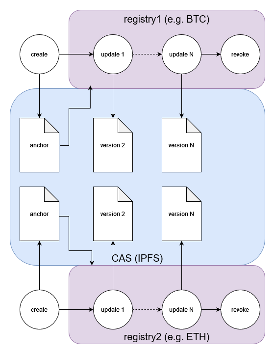

# MDIP DID Scheme


## Abstract

The MDIP (MultiDimensional Identity Protocol) DID method specification conforms to the requirements specified in the [DID specification](https://www.w3.org/TR/did-core/) currently published by the W3C Credentials Community Group. For more information about DIDs and DID method specifications, please see the [DID Primer](https://w3c-ccg.github.io/did-primer/).

## Introduction

The MDIP DID method (`did:mdip`) is designed to support a P2P identity layer with secure decentralized [verifiable credentials](https://www.w3.org/TR/vc-data-model-2.0/). MDIP DIDs are used for agents (e.g., users, issuers, verifiers, and MDIP nodes) and assets (e.g., verifiable credentials, verifiable presentations, schemas, challenges, and responses).

## MDIP DID Format

MDIP DIDs have the following format:

```
mdip-did        = "did:mdip:" mdip-identifier
                 [ ";" did-service ] [ "/" did-path ]
                 [ "?" did-query ] [ "#" did-fragment ]
mdip-identifier = CID encoded with base58btc
```

### Example: MDIP DID

`did:mdip:z3v8AuaYnnFwgRFgkQWnYca2wbvcWN8sa94BfnoJtqbphdTREc6`

## DID Lifecycle



All MDIP DIDs begin life anchored to a CAS (Content-Addressable Storage) such as IPFS. Once created they can be used immediately by any application or service connected to an MDIP node. Subsequent updates to the DID (meaning that a document associated with the DID changes) are registered on a registry such as a blockchain (BTC, ETH, etc) or a decentralized database (e.g. hyperswarm). The registry is specified at DID creation so that nodes can determine which single source of truth to check for updates.

The *key concept of this design* is that MDIP DID creation is decentralized through through the CAS, and DID updates are decentralized through the registry specified in the DID creation. The MDIP DID is decentralized for its whole lifecycle, which is a hard requirement of DIDs.

## DID Creation

DIDs are anchored to a CAS (e.g. IPFS), prior to any declaration on a registry. This allows DIDs to be created very quickly (<10 seconds) and at (virtually) no cost.

MDIP DIDs support two main types of DID Subject: **agents** and **assets**. Agents have keys and control assets. Assets do not have keys, and are controlled by a single agent (the owner of the asset). The two types have slightly different creation methods.

### Agents

To create an agent DID, the MDIP client must sign and submit a "create" operation to the MDIP node. This operation will be used to anchor the DID in the CAS.

1. Generate a new private key
    1. We recommend deriving a new private key from an HD wallet (BIP-32).
1. Generate a public key from the private key
1. Convert to JWK (JSON Web Key) format
1. Create a operation object with these fields in any order:
    1. `type`  must be "create"
    1. `mdip` metadata includes:
        1. `version`  number, e.g. 1
        1. `type`  must be "agent"
        1. `registry`  (from a list of valid registries, e.g. "BTC", "hyperswarm", etc.)
    1. `publicJwk` is the public key in JWK format
    1. `created` time in ISO format
1. Sign the JSON with the private key corresponding the the public key (this enables the MDIP node to verify that the operation is coming from the owner of the public key)
1. Submit the operation to the MDIP node. For example, with a REST API, post the operation to the MDIP node's endpoint to create new DIDs (e.g. `/api/v1/did/`)

Example
```json
{
    "type": "create",
    "created": "2024-03-21T14:17:00.693Z",
    "mdip": {
        "registry": "hyperswarm",
        "type": "agent",
        "version": 1
    },
    "publicJwk": {
        "crv": "secp256k1",
        "kty": "EC",
        "x": "Mhw_QuIwAqtSC7iGs4a5hTn6o9l3n4e41SVxtwSZHsg",
        "y": "PHqyl-KJ74BGYL19Ou-iQ7M-Adn9zKy9xX4wzVPWkcs"
    },
    "signature": {
        "hash": "5a2b4280bed5adac087afb0a143b3bcf21c9f140937ed1964eb1106b2f5c4bdf",
        "signed": "2024-03-21T14:17:00.703Z",
        "value": "0b087eb5f05cfd3563d56fd1edc2b893b2d27ef096514272f989aabd081d37781a14453e8f36536d391c6539d10f6744b4a06ffbf9c559d9383435e278b71554"
    }
}
```

Upon receiving the operation the MDIP node must:
1. Verify the signature
1. Apply JSON canonicalization scheme to the operation.
1. Pin the seed object to the CAS (e.g. IPFS).

The resulting content address (CID for IPFS) in base58btc encoding is used as the MDIP DID suffix. For example the operation above corresponds to CID "z3v8AuaWjjt2tN9HHtQf8Au9ARZ25zzjkmWmkfVvYDaoM3xcnUP" (in base58btc encoding) yielding the MDIP DID `did:mdip:z3v8AuaWjjt2tN9HHtQf8Au9ARZ25zzjkmWmkfVvYDaoM3xcnUP`.

### Assets

To create an asset DID, the MDIP client must sign and submit a `create` operation to the MDIP node. This operation will be used to anchor the DID in the CAS.

1. Create a operation object with these fields in any order:
    1. `type`  must be "create"
    1. `mdip` metadata includes:
        1. `version`  number, e.g. 1
        1. `type`  must be "agent"
        1. `registry`  (from a list of valid registries, e.g. "BTC", "hyperswarm", etc.)
    1. `controller` specifies the DID of the owner/controller of the new DID
    1. `data` can contain any data in JSON format, as long as it is not empty
    1. `created` time in ISO format
1. Sign the JSON with the private key of the controller
1. Submit the operation to the MDIP node. For example, with a REST API, post the operation to the MDIP node's endpoint to create new DIDs (e.g. `/api/v1/did/`)

Example
```json
{
    "type": "create",
    "created": "2024-03-21T18:47:00.655Z",
    "mdip": {
        "version": 1,
        "type": "asset",
        "registry": "hyperswarm"
    },
    "controller": "did:mdip:test:z3v8AuaaBKfwrt2Y7AAbDaGqLNgyn1BDhP7wUFpEMEngmwYwi17",
    "data": {
        "credentials": []
    },
    "signature": {
        "signer": "did:mdip:test:z3v8AuaaBKfwrt2Y7AAbDaGqLNgyn1BDhP7wUFpEMEngmwYwi17",
        "signed": "2024-03-21T18:47:00.729Z",
        "hash": "3810490d72e7c912d3213d5d96b4f9c184b347038b385aadc568a6624810b0ef",
        "value": "e80a12d81b9be8a63440203dccb90e954d21b91e862b3fe72d0f306877292b9a5f8e00881256132225ab39f2cbe9d47012fb4ac32882ac4bfe3bbb49f80efec4"
    }
}
```

Upon receiving the operation the MDIP node must:
1. Verify the signature is valid for the specified controller.
1. Apply JSON canonicalization scheme to the operation object.
1. Pin the seed object to the CAS (e.g. IPFS).

For example, the operation above that specifies an empty Credential asset corresponds to CID "z3v8AuahaEdEZrY9BGfu4vntYjQECBvDHqCG3mPAfEbn6No7AHh" yielding a DID of `did:mdip:z3v8AuahaEdEZrY9BGfu4vntYjQECBvDHqCG3mPAfEbn6No7AHh`.

# DID Update

A DID Update is a change to any of the documents associated with the DID. To initiate an update the MDIP client must sign a operation that includes the following fields:

1. Create a operation object with these fields in any order:
    1. `type` must be set to "update"
    1. `did` specifies the DID
    1. `doc` is set to the new version of the document set, which must include:
        1. `didDocument` the main document
        1. `didDocumentMetadata` the document's metadata
        1. `didDocumentData` the document's data
        1. `mdip` the MDIP protocol spec
    1. `prev` the sha256 hash of the canonicalized JSON of the previous version's doc
1. Sign the JSON with the private key of the controller of the DID
1. Submit the operation to the MDIP node. For example, with a REST API, post the operation to the MDIP node's endpoint to update DIDs (e.g. `/api/v1/did/`)

It is recommended the client fetches the current version of the document and metadata, makes changes to it, then submit the new version in an update operation in order to preserve the fields that shouldn't change.

Example update to rotate keys for an agent DID:
```json
{
    "type": "update",
    "did": "did:mdip:test:z3v8AuadvRQErtPapNx3ncdUJpPc5dBDGTXXiRxsaH2N8Lj2KzL",
    "doc": {
        "@context": "https://w3id.org/did-resolution/v1",
        "didDocument": {
            "@context": [
                "https://www.w3.org/ns/did/v1"
            ],
            "id": "did:mdip:test:z3v8AuadvRQErtPapNx3ncdUJpPc5dBDGTXXiRxsaH2N8Lj2KzL",
            "verificationMethod": [
                {
                    "id": "#key-2",
                    "controller": "did:mdip:test:z3v8AuadvRQErtPapNx3ncdUJpPc5dBDGTXXiRxsaH2N8Lj2KzL",
                    "type": "EcdsaSecp256k1VerificationKey2019",
                    "publicKeyJwk": {
                        "kty": "EC",
                        "crv": "secp256k1",
                        "x": "CkHUpYCLpO-ITepMH8NyR1BinjtC8GEjPZmLbhhvdYQ",
                        "y": "7tbEsQCgPhMx4vgP7anOZEscV0ruXyaEkyKTXaIMniQ"
                    }
                }
            ],
            "authentication": [
                "#key-2"
            ]
        },
        "didDocumentMetadata": {
            "created": "2024-03-25T14:57:20.868Z"
        },
        "didDocumentData": {},
        "mdip": {
            "registry": "hyperswarm",
            "type": "agent",
            "version": 1
        }
    },
    "prev": "fb794984f44fe869a75fade8a7bf31ce0f3f46a3eaded4e286769c62f5d9a9ff",
    "signature": {
        "signer": "did:mdip:test:z3v8AuadvRQErtPapNx3ncdUJpPc5dBDGTXXiRxsaH2N8Lj2KzL",
        "signed": "2024-03-25T14:57:26.343Z",
        "hash": "575612ed3195eef4e1b7d43b3e40f893d834176321fee8ff6ffe51a79647d912",
        "value": "87571672a51e3558ed9a9d4ef5fcad4dafbf22ee881735e579305b3ebb404a1d0891e3b45c8ad5c11c95e3ae76ca6f2328c87313d58fe80713c0887294d9078a"
    }
}
```

Upon receiving the operation the MDIP node must:
1. Verify the signature is valid for the controller of the DID.
1. The node should node verify prev hash
1. Record the operation on the DID specified registry (or forward the request to a trusted node that supports the specified registry).

For registries such as BTC with non-trivial transaction costs, it is expected that update operations will be placed in a queue, then registered periodically in a batch in order to balance costs and latency of updates. If the registry has trivial transaction costs, the update operation may be distributed individually and immediately. The MDIP defers this tradeoff between cost, speed, and security to the node operators.

## DID Revocation

Revoking a DID is a special kind of Update that results in the termination of the DID. Revoked DIDs cannot be updated because they have no current controller, therefore they cannot be recovered once revoked. Revoked DIDs can be resolved without error, but resolvers will return a document set with empty the `didMetada.deactivated` property set to `true`. The `didDocument` and `didDocumentData` properties will be set to empty.

To revoke a DID, the MDIP client must sign and submit a `delete` operation to the MDIP node.

1. Create a operation object with these fields in any order:
    1. `type`  must be "delete"
    1. `did` specifies the DID to be deleted
    1. `prev` the sha256 hash of the canonicalized JSON of the previous version's doc
1. Sign the JSON with the private key of the controller of the DID
1. Submit the operation to the MDIP node. For example, with a REST API, post the operation using the `DELETE` method to the MDIP node's endpoint to update DIDs (e.g. `/api/v1/did/`)


Example deletion operation:
```json
{
    "type": "delete",
    "did": "did:mdip:z3v8AuagQPwk6WhAjauVgkFCBJfHJBVBmNAYEhDNMBEXEmWQrHr",
    "prev": "9f7f0a67b729248c966bb8945cb80320713aa1de42021c88ca849a4ca029f8d7",
    "signature": {
        "signer": "did:mdip:z3v8Auad6fdVkSZE4khWmMwgTjpoMtv82fiT7c56ivNBdjzeMS2",
        "created": "2024-02-05T20:00:54.171Z",
        "hash": "ff71d0966ee87d827bf3674cb1511c845e18f010186326b3898f336b30e94662",
        "value": "92f95f431729858c79ec4c10824e5aa996b7ae5277ec5143af43baf55c7c8d2f73931be5be46da0a7795b5c3b773041a91ccc2755857ddfa34758993428e7ad1"
    }
}
```

Upon receiving the operation the MDIP node must:
1. Verify the signature is valid for the controller of the DID.
1. Record the operation on the DID specified registry (or forward the request to a trusted node that supports the specified registry).

After revocation is confirmed on the DID's registry, resolving the DID will result in response like this:
```json
{
    "@context": "https://w3id.org/did-resolution/v1",
    "didDocument": {},
    "didDocumentMetadata": {
        "created": "2024-03-21T18:47:00.655Z",
        "deactivated": true,
        "updated": "2024-03-21T18:55:11.530Z"
    },
    "didDocumentData": {},
    "mdip": {
        "registry": "hyperswarm",
        "type": "asset",
        "version": 1
    }
}
```

The metadata has a deactivated field set to true to conform to the [W3C specification](https://www.w3.org/TR/did-core/#did-document-metadata).

## DID Resolution

Resolution is the operation of responding to a DID with a DID Document. If you think of the DID as a secure reference or pointer, then resolution is equivalent to dereferencing.

Given a DID and an optional resolution time, the resolver infers the CAS from the format of the suffix, then retrieves the associated document seed, parsing it as plaintext JSON.
If CAS cannot be inferred, or the data cannot be retrieved, then the resolver should delegate the resolution request to a fallback node.
Otherwise, if the data can be retrieved but is not a valid MDIP seed document, an error is returned immediately.
Otherwise, the resolver then evaluates the JSON to determine whether it is a known type (an agent or an asset). If it is not a known type an error is returned.

If we get this far, the resolver then looks up the DID's specified registry in its document seed. If the node does not support the registry (meaning the node is not actively monitoring the registry for updates), then it must forward the resolution request to a trusted node that does support the registry. If the node is not configured with any trusted nodes for the specified registry, then it must forward the request to a trusted fallback node to handle unknown registries.

If the node does support the specified registry, the resolver retrieves all update records from its local database that are keyed to the DID, and ordered by each update's ordinal key. The ordinal key is a value or set of values that can be used to sort the updates into chronological order. For example, the ordinal key for the BTC registry will be a tuple `{block index, transaction index, batch index}`.

The document is then generated by creating an initial version of the document from the document seed, then applying valid updates. In the case of an agent DID, a new DID document is created that includes the public key and the DID as the initial controller. In the case of the asset, a new DID document is created that references the controller and includes the asset data in the document metadata.

If there are any update operations, each one is validated by:
1. verifying that it is signed by the controller of the DID at the time the update was created,
1. verifying that the previous version hash in the operation is identical to the hash of the document set that it is updating,
1. verifying the new version is a valid DID document (schema validation).

If invalid, the update is ignored, otherwise it is applied to the previous document in sequence up to the specified resolution time (if specified) or to the end of the sequence (if no resolution time is specified). The resulting DID document is returned to the requestor.

In pseudo-code:

```
function resolveDid(did, asOfTime=now):
    get suffix from did
    use suffix as content address to retrieve document seed from CAS
    if fail to retrieve the document seed
        forward request to a trusted node
        return
    look up did's registry in its document seed
    if did's registry is not supported by this node
        forward request to a trusted node
        return
    generate initial document from anchor
    retrieve all update operations from did's registry
    for all updates until asOfTime:
        if signature is valid and update is valid:
            apply update to DID document
    return DID document
```

## DID Recovery

For security reasons, MDIP provides no support for storing private keys. We recommend that MDIP clients use BIP-39 to generate a master seed phrase consisting of at least 12 words, and that users safely store the recovery phrase.

If a user loses a device that contains their wallet, they should be able to install the wallet software on a new device, initialize it with their seed phrase and recover their DID along with all their attestations. This implies that a "vault" of the attestations should be stored with the agent DID document, though it should be encrypted with the DID's current private key for privacy.
