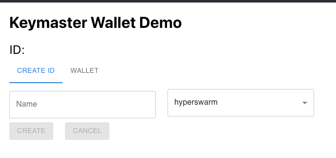

The first time you visit https://mdip.keychain.org/, your browser will automatically generate a new MDIP Wallet. The keys and all information contained in an MDIP wallet are only available on the client-side. The screen below shows a blank MDIP wallet:

An MDIP wallet may contain multiple Agent DIDs, or identities. Each DID can be registered on a registry of the user's choice. Local-only and Hyperswarm global DID distribution are available, along with an upcoming list of immutable ledgers like Bitcoin and many others.

The MDIP Wallet above now contains 1 Agent DID nicknamed "Bob". Once a DID is created, numerous new Keymaster wallet functions become available:

1. [IDENTITIES](./identities): Users can create new Agent DIDs, backup/recover and/or remove undesired Identities.
1. [DIDS](./dids): Users can manage nicknames to known DIDs. Can be used to name any type of DIDs (agent, asset, groups, etc).
1. [GROUPS](./groups): Manage groups of DIDs. Create groups of any types of DIDs. Note: Groups are public.
1. [SCHEMAS](./schema): Manage JSON schemas to be used for attesting credentials. Note: Schemas are public and reusable.
1. [CREDENTIALS](./credentials): Users can issue credential schemas to an agent DID, and accept credentials with the option to view & decrypt prior to acceptance.
1. [AUTH](./auth): Create and/or respond to MDIP authentication challenges. The web UI only supports DID validation at this time.
1. [WALLET](./wallet): Wallet-level backup and restore methods. Seen phrase, upload/download, or in-network backups are available.