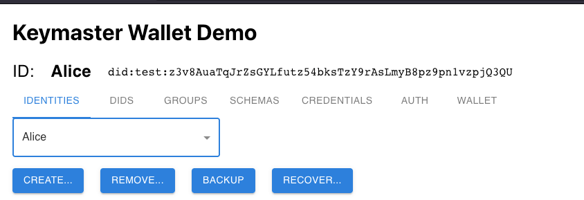
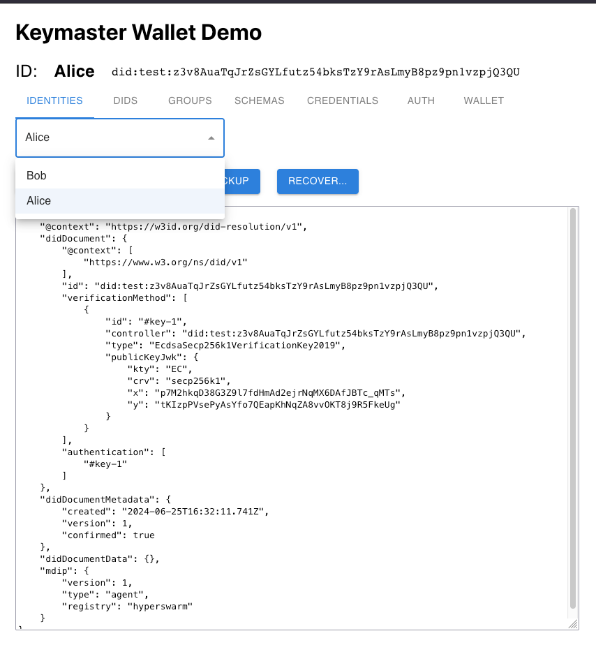

This screen offers the following functionality:

1. CREATE: Creates a new Agent DID and registers the document to the user-selected supported Registry.
1. REMOVE: Removes an Agent DID from the user's local wallet.
1. BACKUP: Backup an Agent DID to an encrypted DID Vault. Recovery is later possible using only wallet keys & DID identifyer.
1. RECOVER: Recovers an Agent DID from its DID Identifier. This will recover the last Agent DID backup stored in the encrypted DID Vault.

