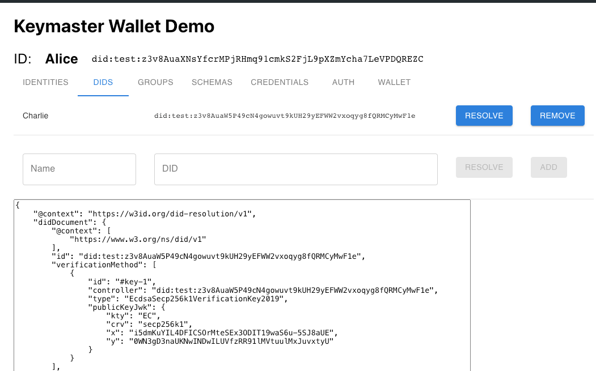

The DIDs screen allow a user to manage named aliases to various DIDs. Named aliases are important to an MDIP wallet since they provide human-friendly context to the content of a DID. Named aliases are NOT part of a DID document; they are local to a user wallet.

