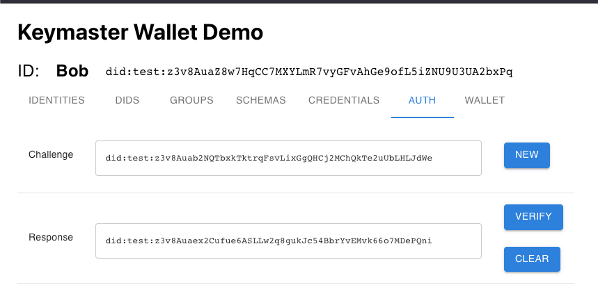

The Authentication screen allows a user to issue and/or respond to MDIP challenges. A Challenge DID is entered (or generated) to the Challenge text field; the user can create a Response DID to the provided challenge. The Response to a Challenge will prove to the challenger that the responder conrols the private keys of a particular DID.

MDIP Authentication is SECURE, like 2FA because it involves more than 1 channel of communication for authenticating a user.
MDIP Authentication is PRIVATE, unlike OAuth because it does not expose authentication events to 3rd parties.

