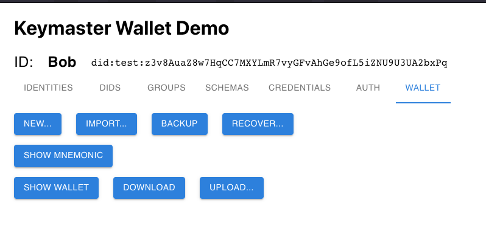

The Wallet screen allows a user to backup their wallet. 3 different backup/restore paths are provided:

- Download / Upload of a wallet to/from local storage
- Recover a wallet keys from 12-words mnemonic
- Restore a wallet content from an encrypted on-network backup

