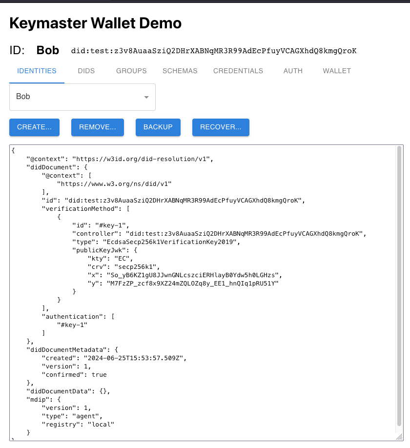
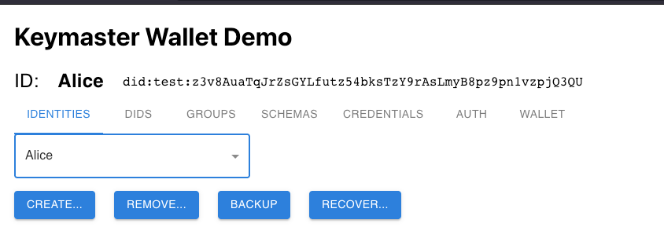
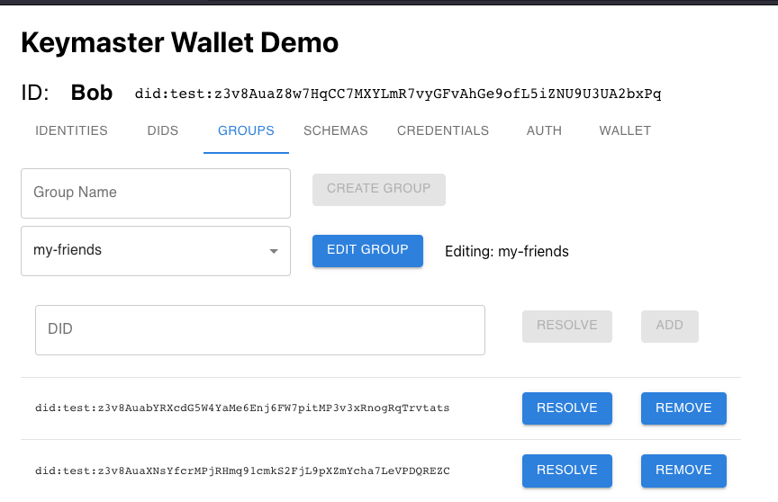
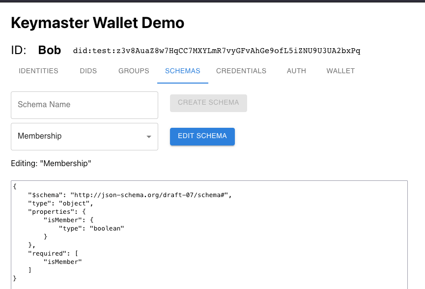
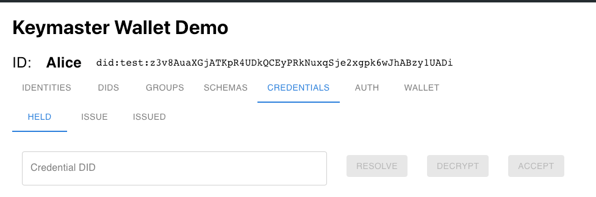
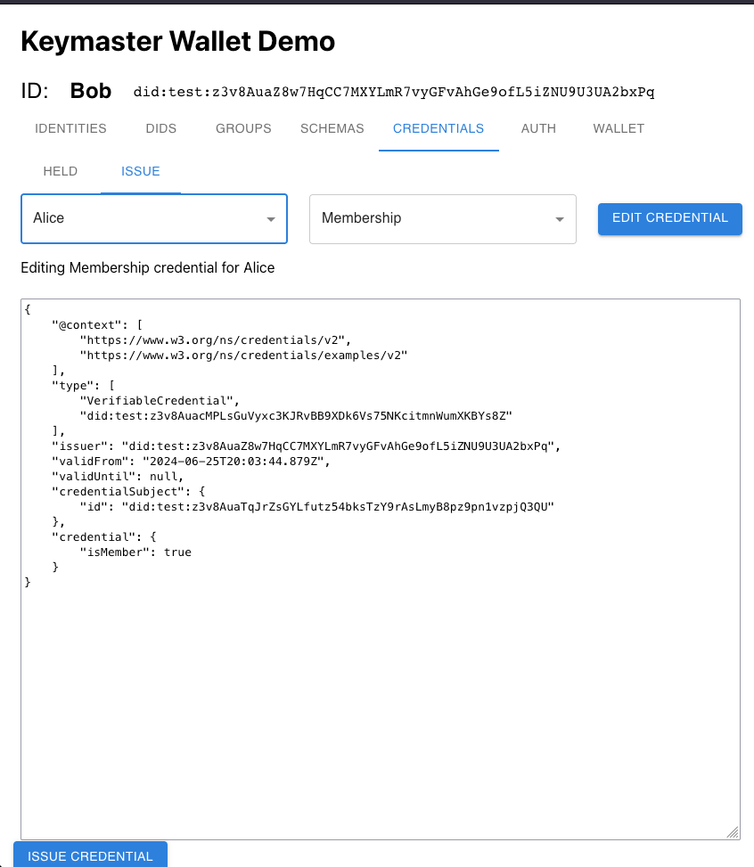
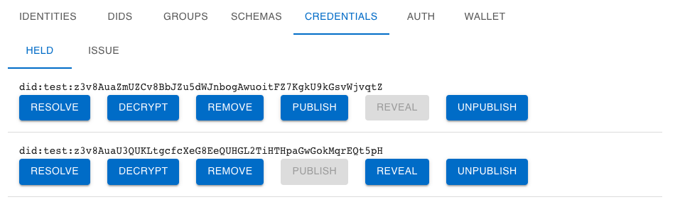
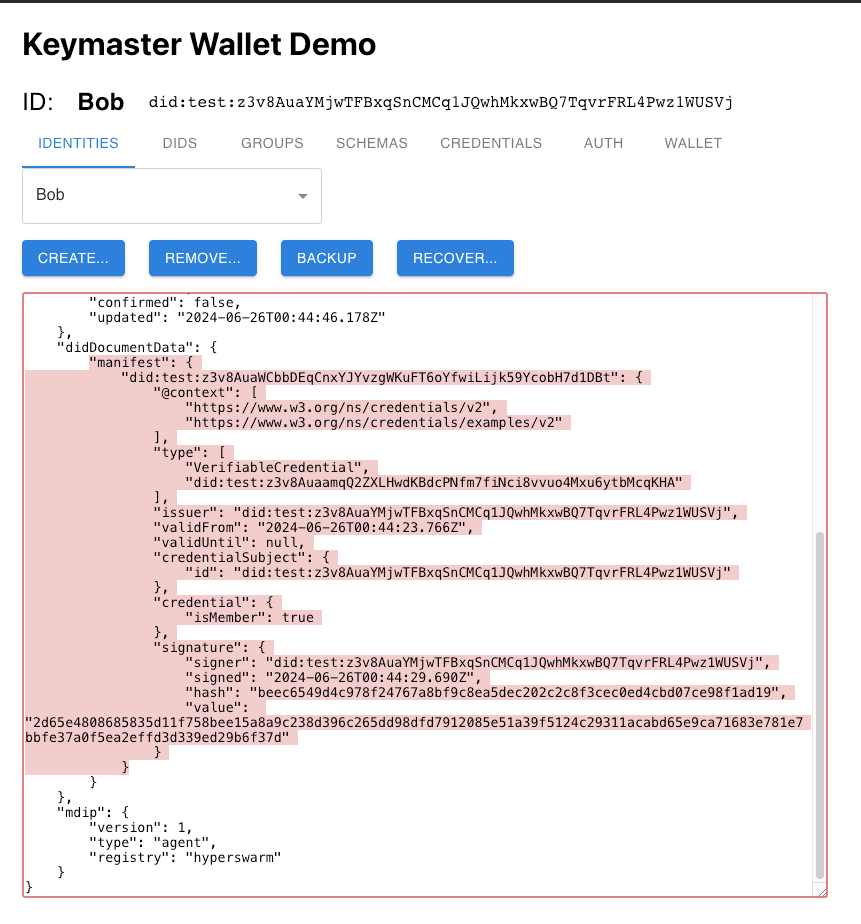

This document contains basic instructions to familiarize you with the use of MDIP's Keymaster WebUI.

The Keymaster WebUI is a client interface to the MDIP Keymaster Library<!--Add link when library docs are written-->, available in the `kc` repository. The WebUI is not intended to be a commercial wallet; it is a reference implementation of an MDIP wallet offering a web (React) user interface to the MDIP Keymaster library.

Wallet creation and MDIP key operations are performed client-side. The server-side is running an MDIP Gatekeeper server, which exposes the Keymaster WebUI server components on port `4224`.

An online version of the MDIP Keymaster WebUI is available here: https://mdip.keychain.org/

## Creating your first DID

Upon visiting the link above, your browser will automatically generate a new MDIP Wallet. The keys and all information contained in an MDIP wallet is only available on the client-side. The screen below shows a blank MDIP wallet:

An MDIP wallet may contain multiple Agent DIDs, or identities. Each DID can be registered on a Registry of the user's choice. Local-only and Hyperswarm global DID distribution are available along with an upcoming growing list of immutable ledgers like Bitcoin and many others.

The MDIP Wallet above now contains 1 Agent DID nicknamed "Bob". Once a DID is created, numerous new Keymaster wallet functions become available.

1. IDENTITIES: User can create new Agent DIDs, backup/recover and/or remove undesired Identities.
1. DIDS: User manage nicknames to known DIDs. Can be used to name any type of DIDs (agent, asset, groups, etc).
1. GROUPS: Manages groups of DIDs. Create groups of any types of DIDs. Note: Groups are public.
1. SCHEMAS: Manage JSON schemas to be used for attesting credentials. Note: Schemas are public and reusable.
1. CREDENTIALS - HOLD: User can accept (hold) a credential with option to view & decrypt prior to acceptance.
1. CREDENTIALS - ISSUE: Issue a credential schema to an agent DID. User can fill-in the schema values.
1. AUTH: Create and/or respond to MDIP authentication challenges. WebUI only supports DID validation at this time.
1. WALLET: Wallet-level backup and restore methods. 12-words, upload/download, or in-network backups are available.

## IDENTITIES Screen

This screen offers the following functionality:

1. CREATE: Creates a new Agent DID and registers the document to the user-selected supported Registry.
1. REMOVE: Removes an Agent DID from the user's local wallet.
1. BACKUP: Backup an Agent DID to an encrypted DID Vault. Recovery is later possible using only wallet keys & DID identifyer.
1. RECOVER: Recovers an Agent DID from its DID Identifier. This will recover the last Agent DID backup stored in the encrypted DID Vault.

## DIDS Screen

The DIDs screen allow a user to manage named aliases to various DIDs. Named aliases are important to an MDIP wallet since they provide human-friendly context to the content of a DID. Named aliases are NOT part of a DID document; they are local to a user wallet.

## GROUPS Screen

The Groups screen allows a user to create groups of DIDs. Groups can also contain DIDs of other groups, enabling the creation of complex organizational structures for a collection of DIDs.

## SCHEMA Screen

The Schema screen allows a user to manage a local collection of credential schemas. MDIP does not impose restriction on a schema's data structures.

## CREDENTIALS Screen

The Credentials screen allows a user to decrypt, accept, or issue verifiable credentials. Users must have created a Schema before a Credential can be issued. The credentials subjects are listed from known Agent DIDs contained in the wallet (from IDENTITIES and DIDS screens).

The credential screen also allows the issuing user to "fill-in" the credential with recipient-specific content. The credential below attests Bob's membership to Alice.

## CREDENTIALS - HELD Screen

In the "HELD" Credentials screen, a user can chose from a variety of options.

- **Resolve**: This will display the *public* (encrypted) view of the credential. Resolving a credential confirms it exists in the MDIP Gatekeeper node.

- **Decrypt**: If the credential is encrypted to the current DID, this will decrypt the cypher_receiver field using the DID keys.

- **Remove**: This removes a credential from the user's wallet.

- **Publish**: This publishes the existence of the credential to the DID manifest, which is visible to the public. The content of the credential is nulled, but the header contains valuable information, notably the DID of the issuer and the DID of the credential schema.

- **Reveal**: This reveals the full content of a credential to the DID manifest, which is visible to the public. The content of the credential is decrypted and included in the DID manifest.

- **Unpublish**: This removes the credential from a DID manifest. Note: other nodes on the network may retain the *history* of a DID; once published or revealed a credential has been winessed by other nodes.

The image below shows a portion of Bob's Agent DID with a revealed "isMember: true" credention in the visible portion of his DID document.

## AUTHENTICATION Screen

The Authentication screen allows a user to issue and/or respond to MDIP challenges. A Challenge DID is entered (or generated) to the Challenge text field; the user can create a Response DID to the provided challenge. The Response to a Challenge will prove to the challenger that the responder conrols the private keys of a particular DID.

MDIP Authentication is SECURE, like 2FA because it involves more than 1 channel of communication for authenticating a user.
MDIP Authentication is PRIVATE, unlike OAuth because it does not expose authentication events to 3rd parties.

## WALLET Screen

The Wallet screen allows a user to backup their wallet. 3 different backup/restore paths are provided:

- Download / Upload of a wallet to/from local storage
- Recover a wallet keys from 12-words mnemonic
- Restore a wallet content from an encrypted on-network backup

