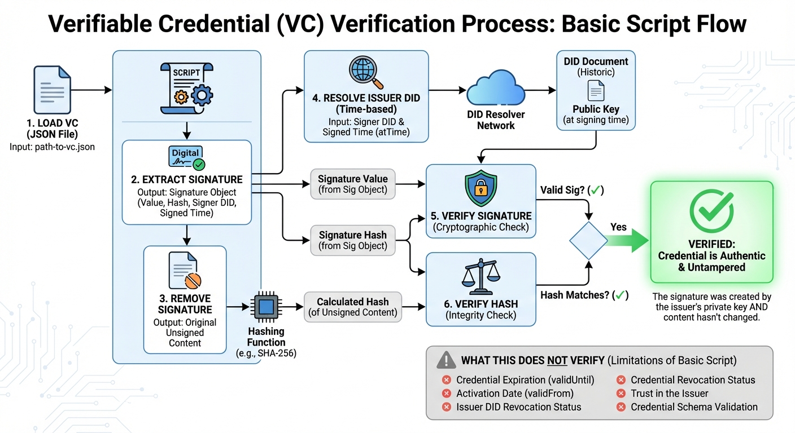

# Verify Verifiable Credential



This script demonstrates the basic steps to verify a Verifiable Credential (VC):

1. **Load the credential** from a JSON file
2. **Extract the signature** from the credential
3. **Remove the signature** to get the original unsigned content
4. **Resolve the issuer's DID** to get their public key (at the time of signing)
5. **Verify the signature** cryptographically
6. **Verify the hash** matches the credential content

## Usage

```bash
node verify-vc.js <path-to-vc.json>
```

## Example

```bash
node verify-vc.js email-vc.json
```

## What Gets Verified

- ✓ The signature was created by the issuer's private key
- ✓ The credential content hasn't been tampered with (hash matches)

## What This Does NOT Verify

This is a minimal educational example. Production verification should also check:
- Credential expiration (`validUntil`)
- Credential activation date (`validFrom`)
- Issuer DID revocation status
- Credential revocation status
- Trust in the issuer
- Credential schema validation

## How It Works

```javascript
// 1. Load and parse the VC
const vc = JSON.parse(fs.readFileSync(file));
const signature = vc.signature;

// 2. Remove signature to get original content
delete vc.signature;

// 3. Get issuer's public key (at time of signing)
const doc = await gatekeeper.resolveDID(signature.signer, {
    versionTime: signature.signed
});
const publicKeyJwk = doc.didDocument.verificationMethod[0].publicKeyJwk;

// 4. Verify signature
const validSig = cipher.verifySig(signature.hash, signature.value, publicKeyJwk);

// 5. Verify hash
const hash = cipher.hashMessage(cipher.canonicalizeJSON(vc));
const hashMatches = (hash === signature.hash);

// Valid if both checks pass
const isValid = validSig && hashMatches;
```

## Key Concepts

- **Signature**: Proves the credential was issued by the claimed issuer
- **Hash**: Ensures the credential content hasn't changed since signing
- **DID Resolution**: Retrieves the issuer's public key from their DID document
- **Time-based Resolution**: Uses `versionTime` to get the key that was valid when signed
